# CHE-48 and follow-up nominal findings

This file records the local acceptance run performed from the tracked CHE-48
designs on 3 September 2026. Results come from the independent seeds 0 through 19
and are not inferred from training rewards.

## Acceptance status

| Policy | Model SHA-256 | Mean return | Mean length | Success | Gate |
| --- | --- | ---: | ---: | ---: | --- |
| `cartpole_lqr_nominal_quantized_v1` | `e3464a8489560dd88fcac5f9ae676983e99a11576b821ff4acb680e55819a2c1` | 500.000 | 500.0 | 100% | pass |
| `cartpole_dqn_nominal_v1` | `db50f5da54bed59a96e45e99af375901369f3daf70b524b74418f4f49dada84a` | 123.400 | 123.4 | 0% | **fail** |
| `cartpole_dqn_nominal_v2` | `a3da508261c696c334155d4cdce3bbda426e48d795852378283a511cc57ca13c` | 19.050 | 19.05 | 0% | **fail** |
| `cartpole_ppo_nominal_v1` | `37c9bac10919b2d6bdc833fd5a3a920460d4b80f09392ef7fb758e4777a856e8` | 500.000 | 500.0 | 100% | pass |
| `pendulum_sac_nominal_v1` | `c13cd159632f3c12e88c2c50c6344b3e4bc35601065e0c32b554b4f6d97c891c` | -129.249 | 200.0 | n/a | pass |
| `minigrid_empty8x8_ppo_partial_image_v1` | `018f0162bbf44835b5d2821702e59b9fb92146cbd909ad0f50e308559c2ccaea` | 0.958 | 12.0 | 100% | pass |

Stable-Baselines3 completed collection boundaries after reaching the requested
lower-bound budgets. The original saved models report 100,096 DQN steps, 50,000
SAC steps, and 500,736 MiniGrid PPO steps for requested budgets of 100,000,
50,000, and 500,000. CartPole PPO reports 100,096 actual steps for its 100,000-step
request.

The separately versioned DQN v2 requested the upstream RL Zoo budget of 50,000
steps and stopped at a collection boundary of 50,176. No other design field
changed. It also failed the original gate: episode lengths ranged from 14 to 25,
with mean 19.05 and no successes. Its final 20 recorded training episodes show a
collapse from longer episodes to lengths mostly between 12 and 20, so the poor
frozen-policy result is consistent with the end of training rather than an
evaluation serialization error.

The exact DQN v1 candidate did not meet either declared CartPole threshold: its
episode lengths ranged from 114 to 136, rather than reaching the 500-step time
limit. It remains preserved with `freeze-failure.json`; no `freeze.json` was
created. The original other three candidates are frozen.

Consequently, the required four-policy, 80-episode `nominal-v1` suite was not
written. This is an intentional integrity constraint: `evaluate-nominal`
preflights every artifact, rejects the unfrozen DQN, and leaves no partial output
directory. Changing the DQN budget or hyperparameters requires a new policy design
version rather than silently replacing this result. DQN v2 was that single
predeclared follow-up; after its failure, no further seed or hyperparameter search
was performed.

## Completed nominal-v2 suite

The separately predeclared CartPole PPO replacement passed with 20 of 20
time-limit successes and mean length 500. `nominal-v2` therefore contains frozen
CartPole LQR, CartPole PPO, Pendulum SAC, and MiniGrid PPO. Its 80 episode bundles
were written to `artifacts/evaluations/nominal-v2/`; each policy passed its gate:

- CartPole LQR: 100% success, mean return and length 500.
- CartPole PPO: 100% success, mean return and length 500.
- Pendulum SAC: mean return -129.249 and mean length 200.
- MiniGrid PPO: 100% success, mean return 0.9578125 and mean length 12.

## Seed-0 inspection

The render command was run in human mode for each frozen artifact using seed 0.
In this headless development session SDL used its dummy video driver; behavior was
also checked from the underlying states, actions, and termination flags.

- The quantized LQR alternated discrete forces to keep the pole near upright and
  the cart near center for all 500 steps. Desired force ranged from about -2.41 N
  to 2.18 N, while the applied action remained the environment's +/-10 N.
- CartPole PPO also completed all 500 steps. It used 250 actions in each direction;
  the cart stayed between approximately -0.115 and 1.021, and the pole angle stayed
  between approximately -0.166 and 0.138 radians.
- SAC started at an angle of about 0.861 rad, swung/stabilized the pendulum at
  approximately 0.003 rad by the final step, and returned -126.161 for seed 0.
- PPO turned south, moved from `(1, 1)` to `(1, 6)`, turned east, and moved to the
  goal at `(6, 6)`. It terminated in 12 actions with return 0.9578125.
- DQN v1 could not be loaded by the frozen-only render command. A read-only
  candidate rollout alternated both actions initially, drifted to the negative
  cart limit, and terminated at step 114 with cart position about -2.413. This
  agrees with its failed aggregate gate. DQN v2 is likewise intentionally
  unavailable to the frozen-only renderer.

The exact gate records and checkpoints live under the ignored local
`artifacts/policies/` tree. Because each manifest records a dirty source state,
these hashes identify this local acceptance run, not a portable checked-in binary
release.

# CHE-49 mandatory perturbation findings

The mandatory CHE-49 run collected 2,040 raw schema-v3 episodes from the frozen
`nominal-v2` artifacts. All trajectory digests verified before analysis. The
policy model hashes still match the CHE-48 table above, so none of the sweeps
changed or replaced a controller. These grid results are descriptive diagnostic
sampling, not estimates under a declared deployment distribution.

## CartPole angle × length surface

The quantized nominal-model LQR survived to the 500-step time limit on all
900 condition-seed pairs. PPO survived on 826 of 900 pairs (91.78%). Its
failures were highly asymmetric in the seeded angle offset:

| Angle offset | LQR success | PPO success | PPO mean length |
| ---: | ---: | ---: | ---: |
| -8 deg | 100% | 49% | 288.34 |
| -6 deg | 100% | 83% | 430.51 |
| -4 deg | 100% | 97% | 488.11 |
| -2 through +6 deg | 100% | 100% | 500.00 |
| +8 deg | 100% | 97% | 487.30 |

The weakest PPO cells were `-8 deg` at lengths `0.35` and `0.50`, both with
40% success. Increasing length to `0.65` raised success at `-8 deg` to 70%, so
the two perturbation axes interact rather than producing a single monotone
distance-from-nominal effect.

Even where both policies achieved nominal success, their trajectories differed.
At zero offset and length `0.50`, LQR versus PPO mean RMS pole angle was
`0.00493` versus `0.06585` radians, mean RMS cart position was `0.0717` versus
`0.6814`, and mean action-switch rate was `0.643` versus `0.907`. Terminal
success alone therefore hides substantial closed-loop behavior differences.

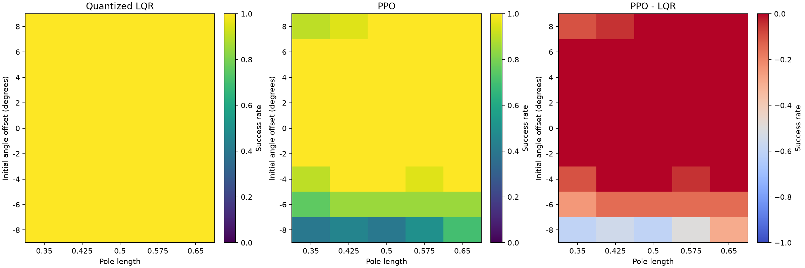

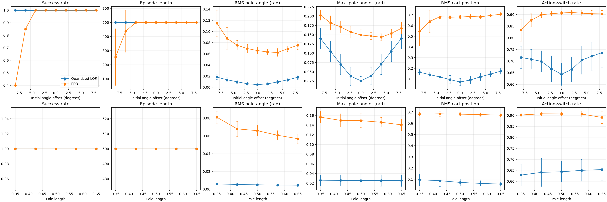

### Three-policy angle × length rerun

The separately versioned `che49-cartpole-angle-length-v2` suite reran the same
45 conditions and seeds 0 through 19 with quantized LQR, the frozen PPO, and
`cartpole_ppo_nominal_v1_antisymmetrized_v1`. It produced 2,700 new raw
schema-v4 episodes. All trajectory digests verified. For each of the two
unchanged policies, all 900 states, observations, actions, rewards, and episode
endings reproduced the v1 scientific trace exactly; the serialized bytes differ
because v1 predates the schema-v4 action and diagnostic fields.

The third policy survived to the time limit in all 900 episodes:

| Angle offset | LQR success | PPO success | Antisymmetrized PPO success | Antisymmetrized PPO mean length |
| ---: | ---: | ---: | ---: | ---: |
| -8 deg | 100% | 49% | 100% | 500.00 |
| -6 deg | 100% | 83% | 100% | 500.00 |
| -4 deg | 100% | 97% | 100% | 500.00 |
| -2 through +6 deg | 100% | 100% | 100% | 500.00 |
| +8 deg | 100% | 97% | 100% | 500.00 |

At the nominal zero-offset, length-0.50 cell, antisymmetrization also changed the
subterminal behavior substantially:

| Policy | RMS pole angle | RMS cart position | Action-switch rate |
| --- | ---: | ---: | ---: |
| Quantized LQR | 0.00493 | 0.07169 | 0.64339 |
| Frozen PPO | 0.06585 | 0.68143 | 0.90671 |
| Antisymmetrized PPO | 0.00938 | 0.06405 | 0.74128 |

Thus the intervention did more than move terminal failures outside the sampled
grid: under nominal conditions it moved the learned controller much closer to
LQR's pole- and cart-regulation regime, while retaining a distinct action-switch
profile. This remains a diagnostic policy intervention, not a replacement frozen
baseline or evidence about performance beyond the declared grid.

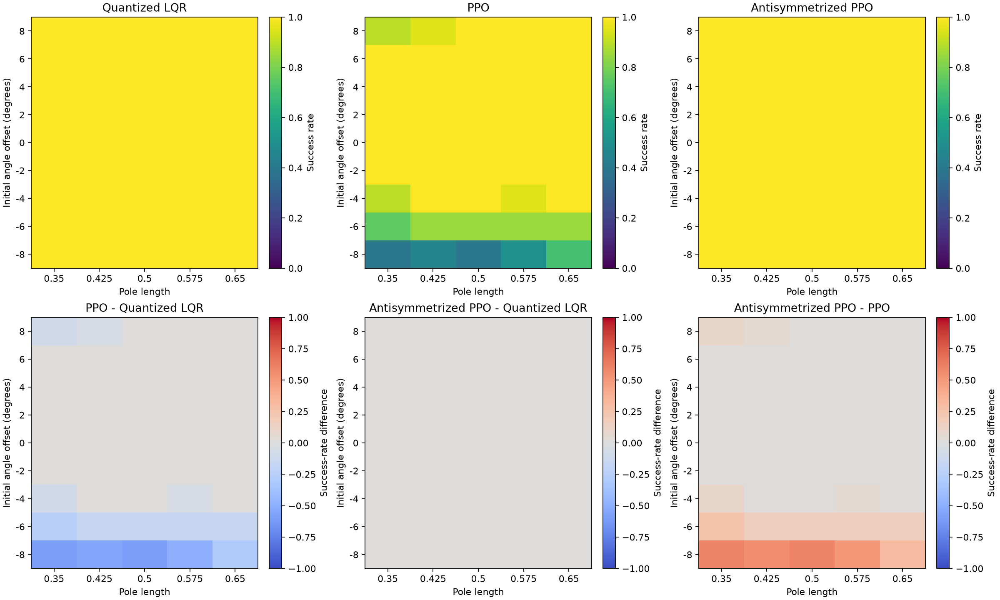

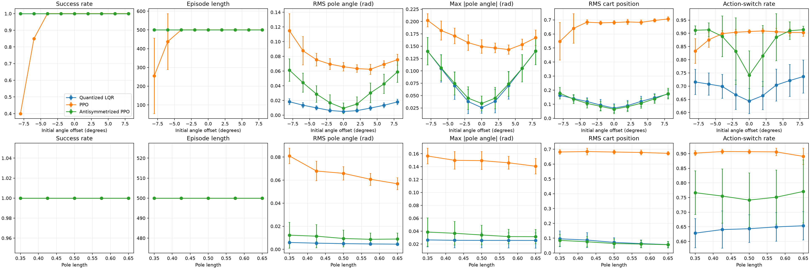

## Pendulum length sweep

The frozen SAC policy degraded smoothly as the pole length increased:

| Length | Mean return | RMS angular error | RMS torque |
| ---: | ---: | ---: | ---: |
| 0.70 | -94.04 | 0.487 | 0.557 |
| 0.85 | -109.23 | 0.544 | 0.556 |
| 1.00 | -129.25 | 0.603 | 0.579 |
| 1.15 | -163.31 | 0.695 | 0.658 |
| 1.30 | -212.41 | 0.804 | 0.790 |

The continuous trajectory metrics reveal degradation without inventing a binary
Pendulum success threshold: longer plants have worse return and angular tracking,
with torque usage rising most clearly beyond the nominal length.

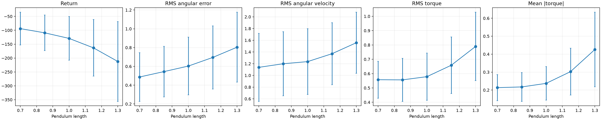

## MiniGrid start-pose map

The frozen partial-image PPO reached the goal from 76 of 140 start
position-orientation pairs (54.29%). Every direction failed from the 16-cell
interior block `x in 2..5, y in 2..5`, while every tested direction succeeded
from the remaining 19 boundary-ring cells. Failed runs exhausted all 256 actions.
Successful runs took 1–24 actions, but path efficiency ranged from `0.053` to
`1.0`, showing that goal completion alone also conceals inefficient navigation.
Initial direction barely changed aggregate successful-run length (means
12.37–12.47 actions).

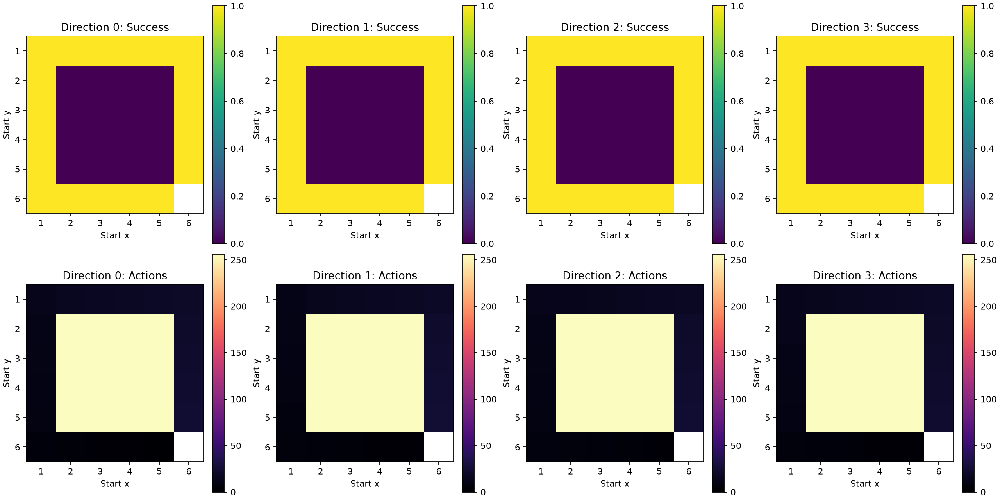

## Active-evaluation questions

1. With only 20 additional CartPole evaluations, should an evaluator concentrate
   on PPO's asymmetric boundary near negative angle offsets, or sample policy
   disagreement against the uniformly successful LQR?
2. Should a useful early-warning metric target terminal failure, trajectory
   degradation such as RMS state error, or the disagreement between those
   signals?
3. For MiniGrid, can an active evaluator infer the sharp interior failure region
   efficiently from sparse start-pose queries while maintaining a fixed target
   distribution over cells and directions?

# CHE-49 secondary and stretch CartPole findings

The five independent follow-up suites added 1,000 raw schema-v4 episodes: five
conditions, 20 paired seeds, and two frozen policies per suite. Analysis used
`episode-summary-v3`; all trajectory hashes and paired-environment checks passed.
The nominal condition in every suite reproduced the no-op states, observations,
requested and delivered actions, rewards, and episode endings. Model hashes still
match the CHE-48 table above.

## Pole mass and force magnitude

Both controllers survived all 500 steps in every mass and force episode. Across
pole masses `0.05` to `0.15`, mean LQR RMS pole angle stayed between `0.00488`
and `0.00494` radians; PPO stayed between `0.06434` and `0.06764`. This sampled
mass range therefore did not separate the policies on success or materially on
state regulation.

Force magnitude also left success at 100%, but it changed how the fixed policies
used the binary actuator. From 5 N to 15 N, LQR mean action-switch rate fell from
`0.744` to `0.598`, while PPO rose from `0.832` to `0.911` after peaking at
`0.917` at 12.5 N. A terminal-only metric would miss that systematic change in
closed-loop behavior.

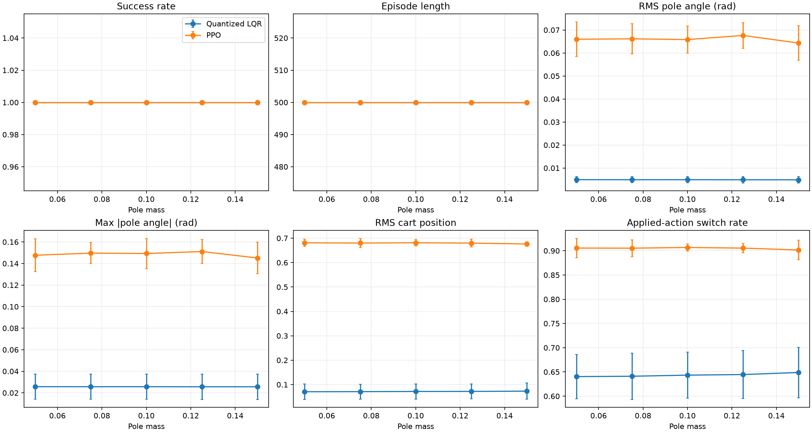

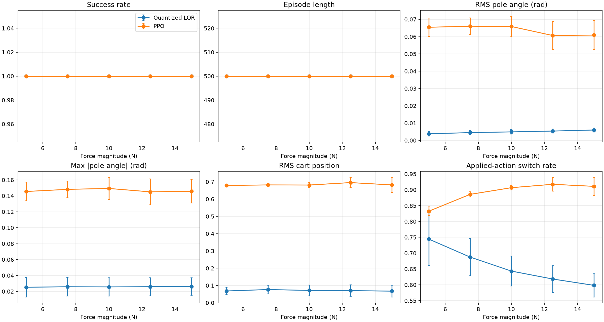

## Pole-angle observation noise

The realized RMS observation errors were `0`, `0.00869`, `0.01737`, `0.03475`,
and approximately `0.06949` radians for the five requested standard deviations,
and paired LQR/PPO streams matched through the shorter trajectory. LQR retained
100% success at every level. PPO retained 100% through 2 degrees, then reached
95% success and mean length `479.25` at 4 degrees. At that endpoint mean true-
state RMS pole angle was `0.02862` for LQR and `0.07697` radians for PPO.

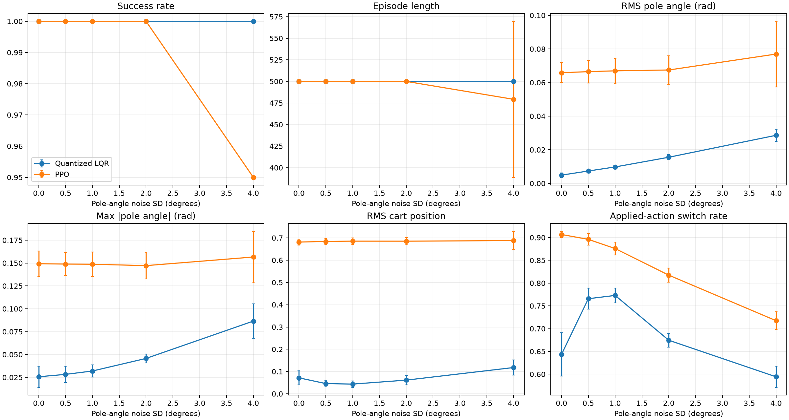

### Three-policy pole-angle-noise rerun

The separately versioned `che49-cartpole-pole-angle-noise-v2` suite added the
antisymmetrized PPO on the identical conditions and seeds. It produced 300 raw
schema-v4 episodes, and all trajectory digests verified. The 100 LQR and 100
frozen-PPO `trajectory.jsonl` files were byte-identical to v1, so the comparison
adds a policy without changing the earlier experiment.

| Noise standard deviation | LQR success | PPO success | Antisymmetrized PPO success | Antisymmetrized PPO RMS pole angle |
| ---: | ---: | ---: | ---: | ---: |
| 0 deg | 100% | 100% | 100% | 0.00938 |
| 0.5 deg | 100% | 100% | 100% | 0.01207 |
| 1 deg | 100% | 100% | 100% | 0.01829 |
| 2 deg | 100% | 100% | 100% | 0.02272 |
| 4 deg | 100% | 95% | 100% | 0.03912 |

At 4 degrees the intervention removed the one observed PPO failure and retained
mean length 500. Its mean true-state RMS pole angle was `0.03912` radians,
between LQR's `0.02862` and PPO's `0.07697`; its RMS cart position was `0.10827`,
compared with `0.11793` and `0.68821`. On this finite sample, enforcing actor
symmetry therefore improved robustness to symmetric observation noise as well as
to the signed initial-angle perturbation.

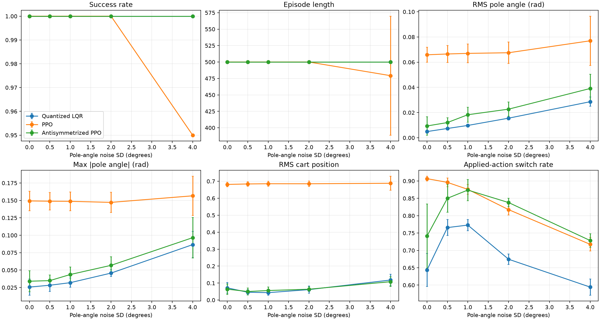

## Action delay and dropout

Delay produced the sharpest policy separation. LQR retained 100% success through
four delayed steps, although its mean RMS pole angle rose from `0.00493` to
`0.09322` radians. PPO fell to 95% success at one step and 0% at two through four
steps; its mean episode lengths at those failing conditions were `100.00`,
`44.95`, and `18.45`. Thus the continuous state metric warns of LQR degradation
even where its binary outcome remains unchanged, while PPO crosses a terminal
failure boundary between one and two delayed steps.

Dropout degraded both controllers monotonically in the sampled range. At
probabilities `0`, `0.05`, `0.10`, `0.20`, and `0.40`, LQR success was 100%,
100%, 95%, 90%, and 20%; PPO success was 100%, 90%, 65%, 40%, and 0%. At the
0.40 endpoint, mean episode length was `253.85` for LQR and `101.75` for PPO.
Realized dropout rates tracked the requested probabilities, while requested/
delivered mismatches were lower because dropping a request that already equals
the held action does not create a mismatch.

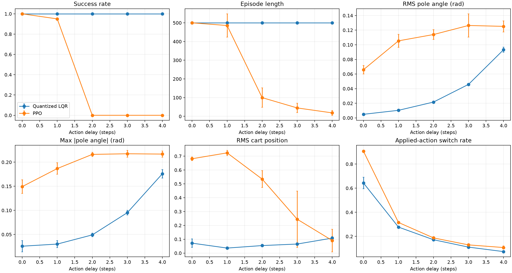

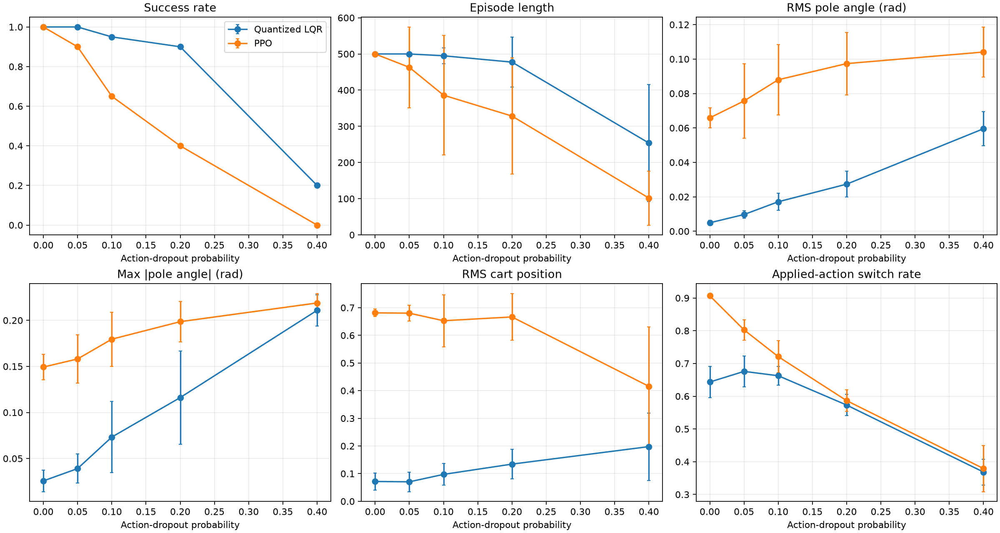

### Three-policy action-channel reruns

The versioned action-delay-v2 and action-dropout-v2 suites each added the same
hash-bound antisymmetrized PPO, again producing 300 raw schema-v4 episodes per
suite. All hashes verified, and all 400 unchanged-policy trajectory files were
byte-identical to their v1 counterparts.

| Delay | LQR success | PPO success | Antisymmetrized PPO success | PPO mean length | Antisymmetrized mean length |
| ---: | ---: | ---: | ---: | ---: | ---: |
| 0 steps | 100% | 100% | 100% | 500.00 | 500.00 |
| 1 step | 100% | 95% | 100% | 485.65 | 500.00 |
| 2 steps | 100% | 0% | 35% | 100.00 | 414.85 |
| 3 steps | 100% | 0% | 0% | 44.95 | 204.90 |
| 4 steps | 100% | 0% | 0% | 18.45 | 115.95 |

Antisymmetrization shifted the sampled PPO delay boundary outward: it retained
100% success at one step and 35% at two steps, where the source PPO had no
successes. It did not recover LQR's robustness, but even at three and four steps
it extended mean survival substantially.

| Dropout probability | LQR success | PPO success | Antisymmetrized PPO success | Antisymmetrized mean length |
| ---: | ---: | ---: | ---: | ---: |
| 0.00 | 100% | 100% | 100% | 500.00 |
| 0.05 | 100% | 90% | 100% | 500.00 |
| 0.10 | 95% | 65% | 95% | 494.85 |
| 0.20 | 90% | 40% | 45% | 411.80 |
| 0.40 | 20% | 0% | 5% | 137.50 |

For dropout, the intervention matched LQR's observed success through probability
`0.10`, then provided only a small advantage over PPO at `0.20` and `0.40` and
remained well below LQR. Its RMS pole angle nevertheless stayed below PPO's at
every nonzero level. These results suggest that repairing the actor's reflection
symmetry removes one source of brittleness but does not supply the feedback
memory or robustness margin needed for severe action-channel faults. RMS values
for failed conditions must be interpreted with episode length because they are
computed over unequal, failure-truncated horizons.

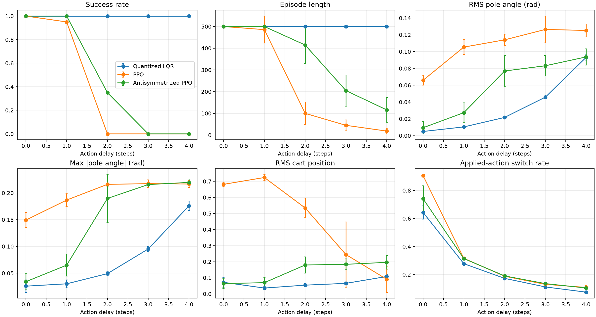

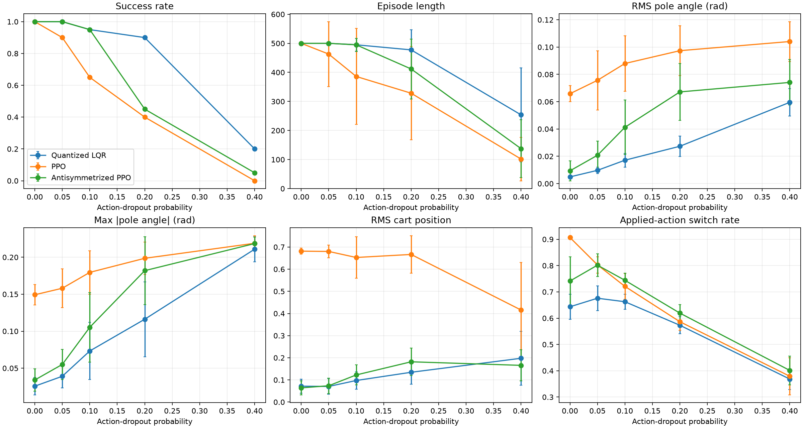

## Follow-up active-evaluation questions

1. Can an evaluator identify PPO's delay boundary near one to two steps with
   fewer samples than a uniform sweep while still detecting LQR's subterminal
   state degradation?
2. Should intervention severity be represented by requested delay/dropout
   parameters, realized random events, or requested/applied action mismatch when
   those measures disagree?
3. Given the flat success surfaces for mass and force, when should an evaluator
   stop probing an axis and redirect budget toward observation or action-channel
   perturbations?

# CHE-49 CartPole PPO symmetry study

The separately versioned `che49-cartpole-symmetry-v1` study audited the frozen
`cartpole_ppo_nominal_v1` checkpoint, collected exact mirror-paired closed-loop
trajectories, and evaluated an antisymmetrized inference intervention. The PPO
model hash remained
`37c9bac10919b2d6bdc833fd5a3a920460d4b80f09392ef7fb758e4777a856e8`;
the intervention did not retrain or change its weights. All 2,500 new raw
schema-v4 trajectory digests verified after collection.

For CartPole state
`s = [x, x_dot, theta, theta_dot]`, physical reflection maps `s` to `-s` and
swaps actions 0 and 1. Actor symmetry therefore requires
`pi(1 | s) = 1 - pi(1 | -s)`, or equivalently an odd binary logit margin
`d(s) = -d(-s)`. The critic should satisfy `V(s) = V(-s)`.

## Frozen-checkpoint audit and decision boundary

The PPO actor does not satisfy the action-distribution identity. At the origin it
assigned action probabilities `[0.9999904, 0.00000959]`; its action-1-minus-action-0
logit margin was `-11.5549`, whereas stochastic reflection symmetry requires both
probabilities to be `0.5` and the margin to be zero.

The audit evaluated the existing angle-length trajectory states and their exact
counterfactual mirrors without advancing an environment:

| Probe set | States | Mean absolute probability error | Deterministic action violation | Mean absolute value error |
| --- | ---: | ---: | ---: | ---: |
| Angle-length reset states | 900 | 0.94873 | 96.11% | 0.00866 |
| Saved policy-input states, stride 25 | 16,825 | 0.52575 | 52.22% | 0.42236 |

Probability error is `abs(pi(1 | s) + pi(1 | -s) - 1)` and is zero for a
symmetric actor. A deterministic violation means that the argmax action was the
same at `s` and `-s`, rather than complementary. The critic is also not exactly
symmetric, although its reset-state error is much smaller than the actor's
distribution error.

One-dimensional slices show a substantially displaced deterministic boundary.
With all other state components zero, the action changes only near cart position
`+0.70`, cart velocity `+0.70`, pole angle `+0.179` radians, or pole angular
velocity `+0.28` radians. An odd logit margin would instead pass through zero at
the origin. The two-dimensional slices below show the observed action boundary
as a solid curve and the boundary required by evaluating reflected states as a
dashed curve; their separation visualizes the nonzero even component of the
actor.

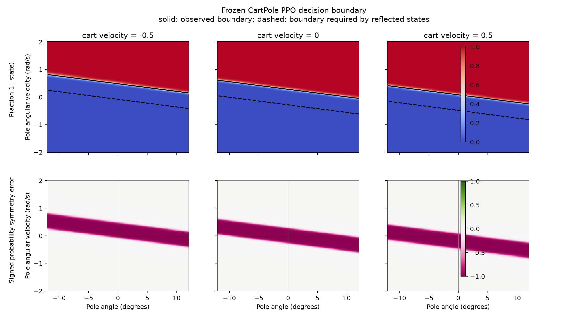

## Exact mirror-paired rollouts

The paired experiment used 20 seeds, angle magnitudes 2, 4, 6, and 8 degrees,
and all five pole lengths. For each seeded positive state `s`, a structured
fixed-state perturbation created a second episode at exactly `-s`. Each policy
therefore had 400 pairs and 800 raw episodes. The unmodified Gymnasium dynamics
receive complementary actions in a physically symmetric pair.

| Policy | First action equivariant | Fully action equivariant | Equal episode length | Positive success | Reflected success | Mean absolute length difference |
| --- | ---: | ---: | ---: | ---: | ---: | ---: |
| Quantized LQR | 100% | 100% | 100% | 100% | 100% | 0.00 |
| Frozen PPO | 1.25% | 0% | 81.25% | 99.25% | 81.25% | 73.64 |

LQR's paired states remained exact negatives up to floating-point comparison in
all 400 pairs, providing a positive control for both the environment symmetry and
the fixed-state protocol. PPO violated the required action swap on the first
decision in 395 of 400 pairs. Its paired success outcomes agreed on 82% of pairs,
with a pronounced 18-percentage-point success difference between the two exact
mirror branches. This establishes closed-loop symmetry breaking without relying
on the earlier seeded `+/-` angle-offset comparison, whose individual states were
not exact mirrors.

## Antisymmetrized-policy intervention

The diagnostic policy computes the frozen actor's binary margins at both `s` and
`-s` and acts from

```text
d_sym(s) = 0.5 * (d(s) - d(-s)).
```

This gives an odd margin by construction while retaining the frozen network as
its only learned component. It is recorded under the distinct derived policy ID
`cartpole_ppo_nominal_v1_antisymmetrized_v1`, with the source policy ID, model
hash, transformation version, and `weights_changed = false` in every episode's
metadata.

The intervention was evaluated on the same 900 signed-angle, pole-length, and
seed combinations as the original sweep. Initial states matched the saved source
episodes exactly:

| Seeded angle offset | Original PPO success | Antisymmetrized PPO success | Original mean length | Antisymmetrized mean length |
| ---: | ---: | ---: | ---: | ---: |
| -8 deg | 49% | 100% | 288.34 | 500.00 |
| -6 deg | 83% | 100% | 430.51 | 500.00 |
| -4 deg | 97% | 100% | 488.11 | 500.00 |
| -2 through +6 deg | 100% | 100% | 500.00 | 500.00 |
| +8 deg | 97% | 100% | 487.30 | 500.00 |

The original positive-minus-negative success gaps at magnitudes 4, 6, and 8
degrees were 3, 17, and 48 percentage points. All became zero after the
intervention. Together with the exact mirror experiment, this is strong causal
evidence that the frozen actor's asymmetric decision boundary drives the sampled
directional failures, rather than the asymmetry coming from CartPole dynamics or
the perturbation implementation.

The conclusion is limited to this frozen checkpoint and declared grid. A
deterministic binary controller cannot choose a self-reflecting action at the
exact origin because CartPole has no neutral action; this is why the categorical
distribution and logit margin are the primary symmetry objects. Finally, the
study establishes that the final trained checkpoint is asymmetric, but not when
that asymmetry arose. Fixed-interval training snapshots or predeclared replicate
training seeds are still required to distinguish optimization-induced symmetry
breaking from an asymmetric initialization.

# CartPole recovery failure-boundary study

This separately versioned study changes the task definition: the pole-angle
termination cutoff is 90 degrees rather than Gymnasium's standard 12 degrees. It
sets the initial pole angle exactly while retaining the seeded cart position,
cart velocity, and pole angular velocity. The plant axis is Gymnasium's pole
half-length. None of these runs trained or changed a policy.

The five-seed pilot sampled 143 conditions. Two deterministic adaptive rounds
added 258 and 713 new conditions, respectively. The capped selector retained 248
conditions for an independent final evaluation with seeds 0 through 49 and all
three policies: 37,200 schema-v4 episodes. All trajectory digests verified under
`episode-summary-v4`. The final raw data occupy 5.7 GB; pilot and refinement raw
data remain separate from the final ground-truth set.

Both co-primary outcomes are reported:

- Survival: reach the 500-step time limit without termination.
- Recovery: survive and have final-100-step RMS pole angle at most 5 degrees.

Every evaluated point on all four domain edges—initial angle `-50` or `+50`
degrees, or half-length `0.02` or `3.0`—had 0% survival and 0% recovery for every
policy. Thus the selected domain encloses the observed success regions rather
than clipping them at a successful edge.

At nominal half-length `0.5`, the central and near-boundary results were:

| Exact initial angle | LQR survival / recovery | PPO survival / recovery | Antisymmetrized PPO survival / recovery |
| ---: | ---: | ---: | ---: |
| -35 deg | 0% / 0% | 0% / 0% | 0% / 0% |
| -30 deg | 100% / 100% | 34% / 2% | 96% / 0% |
| -25 deg | 100% / 100% | 100% / 88% | 100% / 4% |
| 0 deg | 100% / 100% | 100% / 100% | 100% / 100% |
| +25 deg | 100% / 100% | 100% / 98% | 100% / 12% |
| +30 deg | 100% / 100% | 100% / 78% | 98% / 0% |
| +35 deg | 0% / 0% | 0% / 0% | 0% / 0% |

The relaxed cutoff therefore exposes LQR's track-constrained recovery boundary
between 30 and 35 degrees. It also shows why survival alone is inadequate for
the learned policies: antisymmetrized PPO often remained alive for 500 steps
without settling inside the declared recovery band. At the nominal condition,
mean final-window RMS angle was `0.00343`, `0.02207`, and `0.00382` radians for
LQR, PPO, and antisymmetrized PPO, respectively.

Across the 89 final conditions with exact positive/negative counterparts, mean
absolute signed-angle differences in survival rate were 0.25 percentage points
for LQR, 7.01 points for PPO, and 0.79 points for antisymmetrized PPO. Recovery
differences were 0.36, 7.69, and 0.76 points. Antisymmetrization therefore
substantially reduced signed asymmetry, but did not imply stable recovery from
large angles.

Among the 12,400 final episodes per policy, the ending counts were:

| Policy | Survived | Angle-limit failure | Cart-limit failure | Both limits |
| --- | ---: | ---: | ---: | ---: |
| Quantized LQR | 7,334 | 2,052 | 2,983 | 31 |
| PPO | 4,363 | 3,885 | 4,118 | 34 |
| Antisymmetrized PPO | 4,536 | 4,087 | 3,743 | 34 |

These totals describe the adaptively selected condition set, not a deployment
distribution. The machine-readable summary also includes per-cell success
counts, recovery counts, and 95% Wilson intervals.

## Figures

The adaptive mesh is a sparse subset of a lattice: 20 distinct initial angles by
22 distinct half-lengths, of which 248 of 440 slots were sampled. The `_v2`
figures below draw that lattice directly, one cell per slot, so that adaptively
refined regions get the same visual weight as coarse ones and the boundary is
readable as a colour step. Their axes are therefore *mesh rank*, not physical
distance; `cartpole_boundary_physical_geometry_v2.png` is the undistorted
companion. Mid gray means no condition was sampled at that slot, which is a
different statement from a measured rate of zero.

Because 92 to 94 percent of cells sit at exactly 0 or 1, the rate panels use a
discrete colour scale with extra resolution near the transition rather than a
continuous ramp; only 16 to 27 cells per panel are strictly interior, and those
cells are the entire boundary.

The earlier scatter renderings (`cartpole_boundary_survival.png`,
`cartpole_boundary_recovery.png`,
`cartpole_boundary_recovery_gap_failure_cause.png`) remain in `docs/figures/`
as the historical record of how this study was first read.

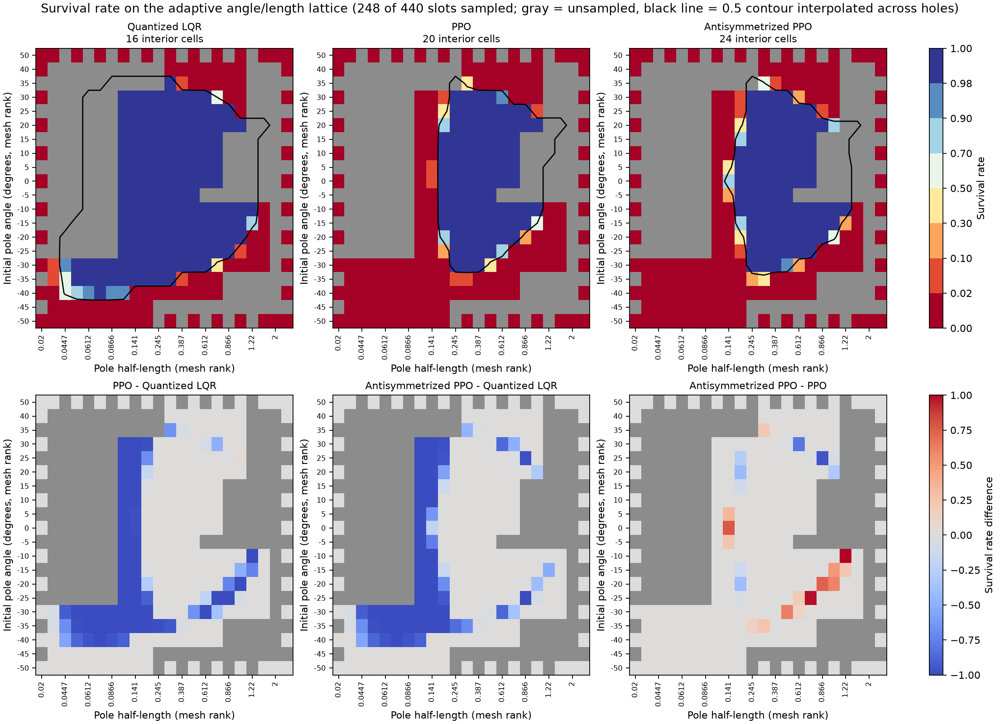

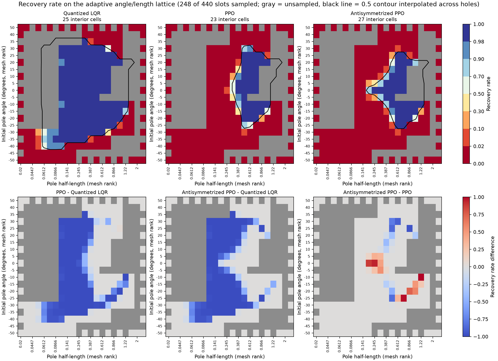

Survival and recovery on the mesh lattice. The top row is the per-policy rate
with the 0.5 contour; the bottom row is the pairwise difference between
policies, which is where the LQR-versus-PPO comparison actually lives.

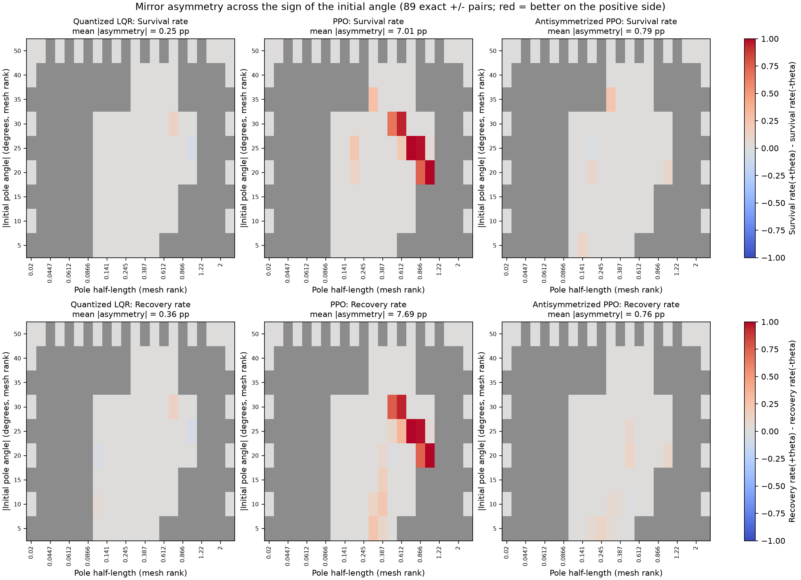

Mirror asymmetry across the sign of the initial angle, over the 89 conditions
with an exact positive/negative counterpart. This is the figure form of the
asymmetry numbers reported above: PPO's asymmetry is a bright diagonal streak
reaching a full 1.00 difference at `|theta| = 25, L = 0.75` and
`|theta| = 20, L = 1.0`, while LQR and antisymmetrized PPO are near-blank.

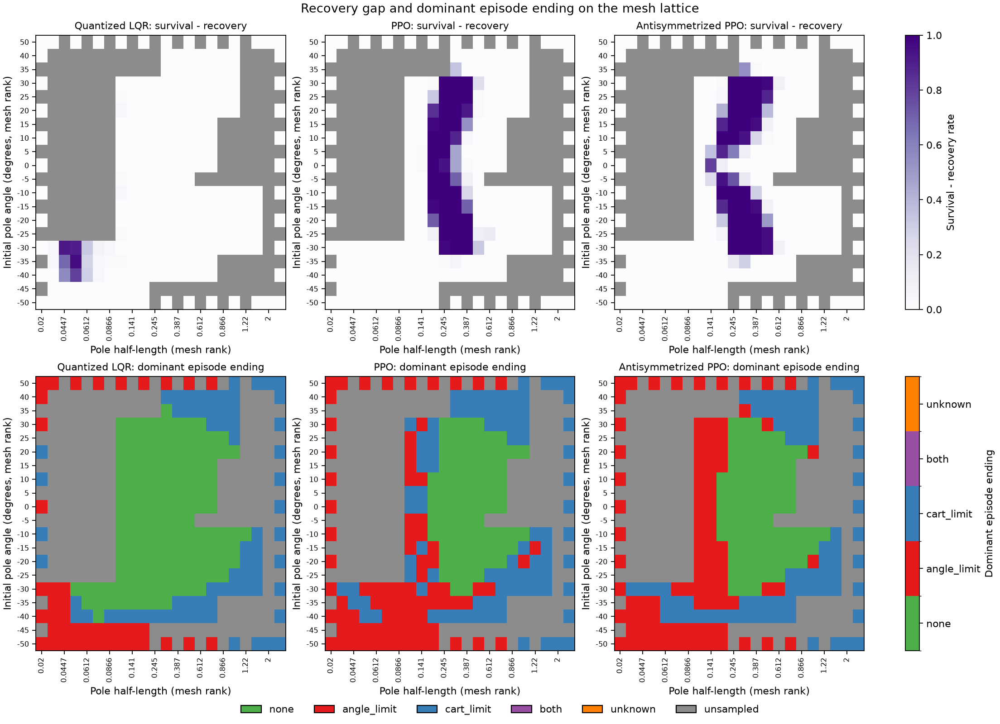

The survival-minus-recovery gap and the dominant episode ending. The gap panel
is where "survived but never settled" shows up as a solid band for both learned
policies.

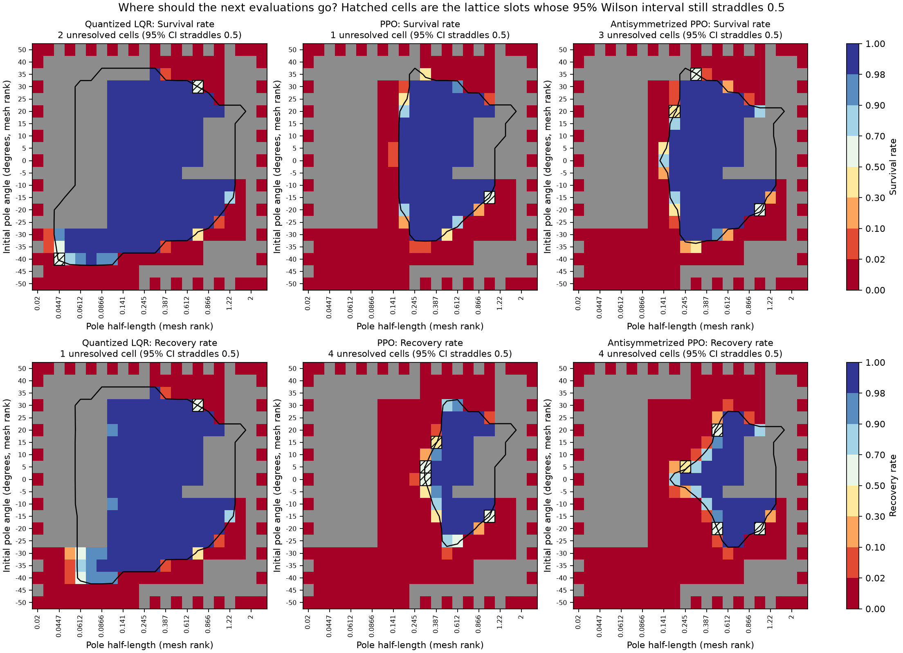

Hatched cells are the lattice slots whose 95% Wilson interval still straddles
0.5 after 50 seeds: 2, 1 and 3 cells for survival and 1, 4 and 4 for recovery
(LQR, PPO, antisymmetrized PPO). These are the conditions where the boundary is
still statistically unresolved, and therefore the most direct answer this study
offers to the question of where an outer evaluator should spend its next
evaluations.

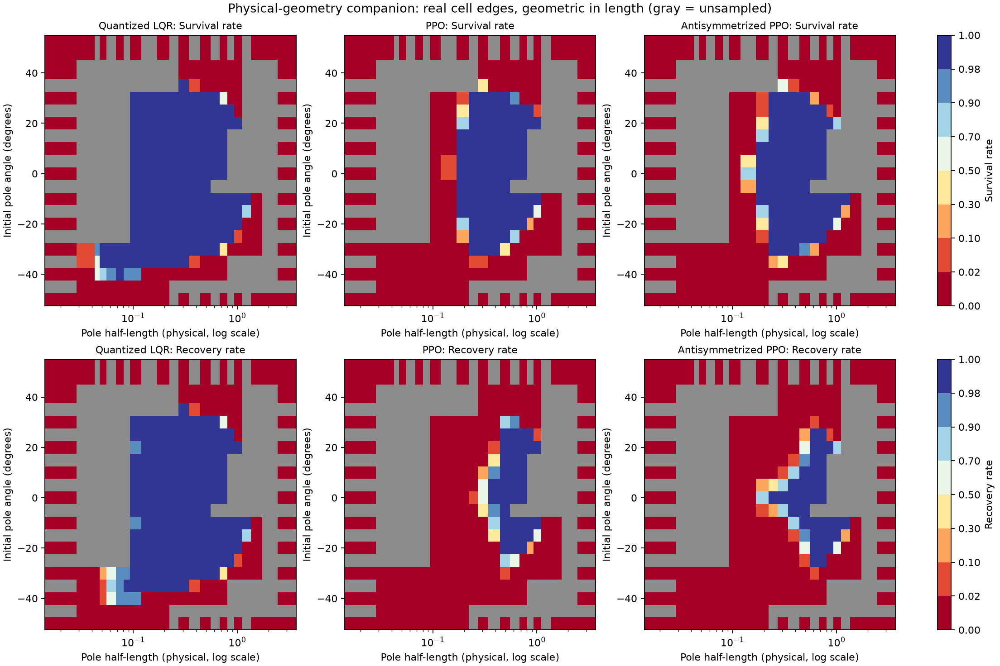

The same rates in physical coordinates, with true cell edges and a log-scaled
length axis, so the real aspect ratio of the survivable region stays on record.

## Animations

Three animations replay the saved boundary-study trajectories. They train
nothing and re-simulate nothing: each frame is drawn from episodes already on
disk, and every manifest records the SHA-256 of each source trajectory. All
three run 50 paired seeds with no subsampling. Because `artifacts/` is
gitignored, regenerate them with `active-eval-gym animate-sweep --evaluation
artifacts/evaluations/cartpole-failure-boundary-v1/final --condition ... `.

The copies embedded below are hosted externally at `assets.chesium.com` rather
than tracked in the repository, so the GIFs add no weight to the git history.
They are downscaled to 80% with a 64-colour palette for faster page loads; the
full-resolution renders they were made from stay under the ignored
`artifacts/animations/` tree.

Each panel scales its own pole to its own length, since this study spans a 150x
range in half-length; cart positions and the `+/- x_threshold` markers stay on
one shared scale so panels remain comparable. The amber wedge is the `+/-5`
degree recovery band and the amber bar is the trailing 100-step scoring window.
Each policy chip reads live seeds, then the mean trailing-100-step RMS `|theta|`
over those still-alive seeds.

**A. Boundary crossing** (`artifacts/animations/che49-boundary-crossing-v1`) —
half-length fixed at `0.5`, initial angle stepping through
`-35, -30, -25, 0, +25, +30, +35`. At the final frame the `+/-35` panels are
empty for every policy, and `-30` reads LQR 50/50, PPO **17/50**, antisymmetrized
PPO 48/50, reproducing the 1.00 / 0.34 / 0.96 survival rates in the table above.
A fractional success rate is directly legible as how much of the density cloud
is left. One thing the numbers alone do not say: at `+/-35` the carts are pinned
at `-/+2.4` when they die, so failure at that edge is cart-position, not the
90-degree angle limit.


**B. Signed asymmetry** (`artifacts/animations/che49-boundary-asymmetry-v1`) —
`(theta = -25, L = 0.75)` against `(theta = +25, L = 0.75)`, PPO and
antisymmetrized PPO only. Both are alive and overlapping at `t = 0.6` s; by
`t = 1.2` s raw PPO has fanned out and is falling while antisymmetrized PPO
swings back upright; by `t = 2.0` s PPO is 0/50 on the negative side and 50/50
on the positive side, with antisymmetrized PPO 50/50 on both. That is the
`+1.00` mirrored survival difference in one frame pair.


**C. Survival without recovery**
(`artifacts/animations/che49-boundary-survival-without-recovery-v1`) —
`(theta = +30, L = 0.387)` plus three companions, all at survival 1.00 and
recovery 0.00 for the learned policies. At `t = 10` s every policy is 50/50
alive, but LQR sits at 0.3 to 0.4 degrees inside the wedge while PPO and
antisymmetrized PPO read 6.8/9.9, 20/23, 13/17 and 7.9/11 degrees, plainly
outside it. This is the clearest statement of why survival alone is an
inadequate metric for these policies.


Two honest limitations of the rendering. The recovery wedge is anchored at panel
centre rather than at each moving cart's axle, because 150 per-run wedges would
be unreadable; when carts sit off-centre, compare the pole's slope against the
wedge edges and treat the numeric readout as the precise value. And the wedge is
an instantaneous-angle reference while recovery is a trailing-RMS criterion, so
a pole can momentarily sit inside the wedge while the readout exceeds 5 degrees
- the sustained swinging is what the metric penalises.
