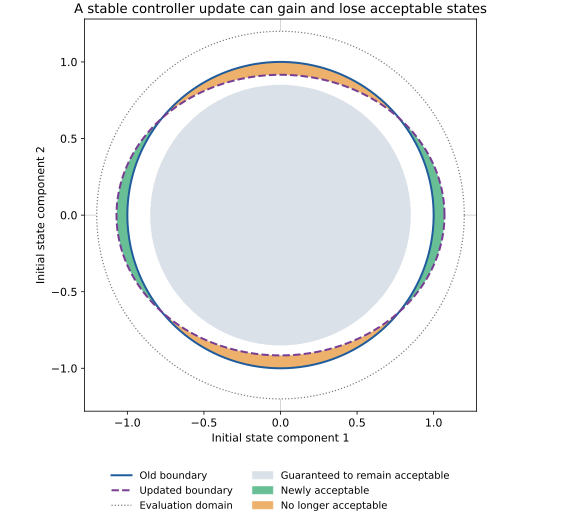

# Understanding the linear control result and its bridge to retraining

This note explains the corresponding section of [the proposal brief](../brief.md#linear-control-result-and-a-bridge-to-retraining), assuming basic linear algebra and feedback control. The main idea is **to put a bound on how much performance can change**. First we change the initial state while holding the controller fixed. Then we change the controller while holding the initial state fixed. The second bound identifies conditions that will remain acceptable after an update.

These are elementary analytical results that give the project a tractable control-theory foundation. The research question comes afterward: can choosing training conditions near the performance boundary produce updates that gain more acceptable conditions than they lose?

The main reference is João P. Hespanha, *Linear Systems Theory*, second edition (2018), available as the [local textbook PDF](../literature/Linear-Systems-2e.pdf). The [author’s book page](https://web.ece.ucsb.edu/~hespanha/linearsystems/) confirms the edition and describes its prerequisite level. Page references below use **printed page numbers**; in this local PDF, add 19 to obtain the PDF viewer page number. The derivations and numerical examples here are explanations for this proposal, not claims of new textbook theorems. The existing [design notes](proposal-design-notes.md#linear-result-derivation-and-limits) give a more compact treatment.

## 1. Start with the plant and close the feedback loop

Write a discrete-time plant as

$$
x_{j+1}=Ax_j+Bu_j.
$$

The state $x_j\in\mathbb R^n$ collects the variables needed to predict the next step, such as position and velocity. The input $u_j\in\mathbb R^m$ is the control action. The matrix $A\in\mathbb R^{n\times n}$ describes evolution without an input, and $B\in\mathbb R^{n\times m}$ describes how the input changes the state. The index $j$ counts simulation steps. Assume the target equilibrium is the origin; otherwise, coordinates can describe deviations from the target.

A linear state-feedback controller chooses

$$
u_j=-Kx_j,\qquad K\in\mathbb R^{m\times n}.
$$

Substitution gives

$$
x_{j+1}=Ax_j-BKx_j=(A-BK)x_j=G_Kx_j.
$$

Thus **$G_K$ combines the plant and controller into one matrix describing the closed loop**. We can now compute the trajectory by repeated multiplication:

$$
x_0=x,\qquad x_1=G_Kx,\qquad x_2=G_K^2x,\qquad x_j=G_K^jx.
$$

Here $x$ denotes the initial state and $G_K^0=I$, the identity matrix. The controller remains fixed throughout this trajectory. A new controller $K'$ is evaluated in a separate trajectory; the prime means “new,” not transpose or derivative. We use $\top$ for transpose.

For this calculation, assume known, constant matrices, full-state feedback, and deterministic dynamics without disturbances, action quantization, saturation, or early termination. The radius restriction introduced later limits **initial states**; it does not assert that the subsequent trajectory stays inside that radius.

Textbook connection: §1.1.2, p. 6, introduces discrete-time state-space models; §6.5, p. 69, gives their solutions using matrix powers. The feedback substitution also appears in the continuous-time LQR discussion in §10.4, pp. 122–123. Here we apply it to discrete time.

## 2. Turn a whole trajectory into one performance number

Suppose we penalize state deviation at each step by

$$
x_j^\top Qx_j,\qquad Q\succeq0.
$$

The notation $Q\succeq0$ means that $Q$ is symmetric positive semidefinite: $v^\top Qv\ge0$ for every vector $v$. It ensures that each penalty is nonnegative. For example, with $x_j=(a_j,v_j)^\top$ and $Q=\operatorname{diag}(10,1)$, the penalty is $10a_j^2+v_j^2$. Choosing $Q$ specifies which errors matter and their relative scales. State coordinates and units should be fixed before interpreting Euclidean distances or these weights.

For an integer horizon $H\ge1$, define the evaluation cost

$$
J_{H,K}(x)=\sum_{j=0}^{H-1}x_j^\top Qx_j.
$$

Lower cost is better. This definition includes the initial-state cost and ends at $x_{H-1}$; it has no separate terminal penalty. In particular, $H=1$ evaluates only $x^\top Qx$, so the controller cannot affect that cost.

Replace each $x_j$ with $G_K^jx$:

$$
\begin{aligned}
J_{H,K}(x)
&=\sum_{j=0}^{H-1}(G_K^jx)^\top Q(G_K^jx)\\
&=\sum_{j=0}^{H-1}x^\top(G_K^j)^\top QG_K^jx\\
&=x^\top\underbrace{\left[\sum_{j=0}^{H-1}(G_K^j)^\top QG_K^j\right]}_{P_H(K)}x.
\end{aligned}
$$

**$P_H(K)$ summarizes how initial-state errors accumulate into cost over the entire horizon.** $Q$ scores one state; $P_H(K)$ scores a trajectory through its initial state. Each summand is symmetric positive semidefinite, so $P_H(K)$ is too.

For example, take the scalar system $x_{j+1}=0.5x_j$, $Q=1$, and $H=3$. Its three scored states are $x,0.5x,0.25x$, giving

$$
J_{3,K}(x)=x^2+(0.5x)^2+(0.25x)^2=1.3125x^2.
$$

Here $P_3(K)$ is just the number $1.3125$. In higher dimensions it is a matrix because different initial directions can produce different behavior.

An equivalent computation is $P_0=0$ and

$$
P_{H+1}=Q+G_K^\top P_HG_K.
$$

This is evaluation of a given controller. Computing an optimal LQR gain would be an additional design problem. Standard LQR also typically includes an input penalty $u_j^\top Ru_j$. Under fixed feedback that becomes $x_j^\top K^\top RKx_j$; it would make the stage-cost matrix depend on $K$. The brief deliberately uses a fixed state-cost matrix $Q$, so its update formulas should not silently be applied to that different objective.

Textbook connection: §8.4, p. 91, reviews positive-definite matrices and quadratic forms; §10.1, p. 120, introduces quadratic trajectory criteria in optimal control. You do not need to solve a Riccati equation to derive the formula above.

## 3. Interpret the acceptable region geometrically

Choose a cost threshold $h>0$ and an evaluation domain

$$
D=\{x:\|x\|_2\le r\},\qquad r>0.
$$

The acceptable initial states are

$$
S_K^J=\{x\in D:J_{H,K}(x)\le h\}.
$$

The superscript $J$ reminds us that acceptability is defined by continuous cost. The scalar example with $h=1$ has the acceptable interval $|x|\le\sqrt{1/1.3125}\approx0.873$, intersected with $D$.

In two dimensions, suppose $P=\operatorname{diag}(p_1,p_2)$ with both entries positive. Then

$$
p_1x_1^2+p_2x_2^2\le h
$$

describes a filled ellipse with axis lengths from the center $\sqrt{h/p_1}$ and $\sqrt{h/p_2}$. A larger penalty in a direction means less initial error is acceptable in that direction. A general positive-definite $P$ rotates the ellipse: its eigenvectors determine the axes and its eigenvalues determine their lengths. Higher-dimensional versions are ellipsoids.

If $P$ is only semidefinite, some directions may have zero cost and the unrestricted sublevel set can be unbounded. Intersecting with $D$ still bounds the evaluation domain. Positive-definite $Q$ ensures positive-definite $P_H$ for $H\ge1$, since the first summand is $Q$.

These are **performance regions over a specified horizon**. Membership alone does not guarantee that a trajectory never violates another constraint or eventually reaches the origin.

## 4. First result: nearby initial states have bounded cost differences

Keep $K$ fixed and compare starts $x$ and $x'$. The question is: if one start has acceptable cost, how far can we move the start while retaining that conclusion?

We need one matrix-norm fact. The Euclidean vector norm $\|v\|_2$ is ordinary length. Its corresponding matrix norm is

$$
\|M\|_2=\max_{\|v\|_2=1}\|Mv\|_2,
$$

the largest factor by which multiplication by $M$ stretches a vector. Consequently,

$$
|a^\top Mb|\le\|a\|_2\|M\|_2\|b\|_2.
$$

This combines the Cauchy–Schwarz inequality with $\|Mb\|_2\le\|M\|_2\|b\|_2$. For a symmetric positive-semidefinite $P$, $\|P\|_2$ is its largest eigenvalue. For a general matrix, it is the largest singular value, which need not be the largest eigenvalue magnitude. These facts are reviewed in textbook §8.2, pp. 88–90.

Abbreviate $P_H(K)$ to $P$. Add and subtract $x'^\top Px$:

$$
\begin{aligned}
x^\top Px-x'^\top Px'
&=(x-x')^\top Px+x'^\top P(x-x'),\\
|J_{H,K}(x)-J_{H,K}(x')|
&\le\|P\|_2(\|x\|_2+\|x'\|_2)\|x-x'\|_2\\
&\le2r\|P_H(K)\|_2\|x-x'\|_2.
\end{aligned}
$$

The last step uses $x,x'\in D$. This is a **Lipschitz bound** on that domain: cost changes by at most a constant times initial-state distance. Call the constant $L=2r\|P_H(K)\|_2$.

To use it, suppose $J_{H,K}(x)=h-m$, where $m>0$ is the available cost margin. Then

$$
J_{H,K}(x')\le h-m+L\|x'-x\|_2.
$$

Therefore every $x'\in D$ satisfying $L\|x'-x\|_2\le m$ is acceptable. If $L>0$, the guaranteed neighborhood has radius $m/L$. For instance, $h=10$, measured or analytically computed cost $8$, and $L=4$ give a radius of $0.5$. An upper bound of $8$ on the cost also suffices; a noisy point estimate alone does not provide the same guarantee.

This is a sufficient condition: a point farther away can still be acceptable. A large $L$ makes the rule conservative. With known linear dynamics, direct evaluation of $x'^\top Px'$ is easier and exact; the bound is useful as an interpretable model of how justified generalization between evaluated conditions could work.

## 5. Why horizon and transient amplification matter

The constant in the first result depends on $P_H(K)$, and hence on all powers $G_K^j$:

$$
\|P_H(K)\|_2\le\|Q\|_2\sum_{j=0}^{H-1}\|G_K^j\|_2^2.
$$

Because the additional stage costs are nonnegative, increasing $H$ can increase accumulated cost. With a fixed threshold, it can therefore shrink the acceptable region. It can also increase the sensitivity bound.

For discrete-time linear systems, eigenvalues strictly inside the unit circle imply asymptotic stability: every trajectory tends to zero. **This allows temporary growth before decay.** For example,

$$
G=\begin{pmatrix}0.5&4\\0&0.5\end{pmatrix},\qquad
x_0=\begin{pmatrix}0\\1\end{pmatrix}
$$

has both eigenvalues equal to $0.5$, but

$$
x_1=\begin{pmatrix}4\\0.5\end{pmatrix},\qquad
\|x_1\|_2=\sqrt{16.25}\approx4.03>\|x_0\|_2=1.
$$

With $Q=I$ and $H=2$, this start incurs cost $1+16.25=17.25$. The off-diagonal entry transfers the second component into a large first component. In fact, for $j\ge1$,

$$
G^j=\begin{pmatrix}0.5^j&4j\,0.5^{j-1}\\0&0.5^j\end{pmatrix},
$$

which eventually tends to zero. No Jordan-form background is needed to check this expression by multiplication.

If we establish constants $c\ge1$ and $0<\rho<1$ such that $\|G_K^j\|_2\le c\rho^j$, then

$$
\|P_H(K)\|_2
\le\|Q\|_2c^2\frac{1-\rho^{2H}}{1-\rho^2}.
$$

The decay factor $\rho$ describes eventual contraction; $c$ allows for amplification. Such constants exist for a Schur-stable matrix, but one cannot generally set $c=1$ or set $\rho$ equal to the largest eigenvalue magnitude. Textbook §8.6, pp. 95–97, gives the discrete-time stability conditions; §7.2, pp. 78–79, explains the matrix-power behavior behind them.

The finite-horizon bounds themselves require no stability assumption. Unstable matrices still have finite powers for finite $H$, although their resulting bounds can become very large.

## 6. Second result: bound the effect of changing the controller

Now keep $x$ fixed and compare old feedback $K$ with updated feedback $K'$. Hold $A,B,Q,H,h,r$ fixed. The update changes $G_K$, which changes the trajectory and the cost matrix. Define

$$
\Delta P=P_H(K')-P_H(K).
$$

Then

$$
\begin{aligned}
|J_{H,K'}(x)-J_{H,K}(x)|
&=|x^\top\Delta Px|\\
&\le\|x\|_2^2\|\Delta P\|_2\\
&\le r^2\|\Delta P\|_2=:b.
\end{aligned}
$$

**Every initial state in $D$ experiences a cost change of at most $b$.** This bounds both improvements and degradations. Although each cost matrix is semidefinite, their difference can have positive and negative eigenvalues: an update can help some directions and hurt others.

For a given state, the sharper bound is $\|x\|_2^2\|\Delta P\|_2$. The single number $b$ is convenient because it works across the whole domain. With known matrices it can be computed after an update. By itself it does not tell a training algorithm which update to choose.

## 7. Turn the update bound into a preservation guarantee

An old acceptable state has cost margin

$$
m_K(x)=h-J_{H,K}(x)\ge0.
$$

Its new cost is at most its old cost plus $b$. Thus if its margin is at least $b$,

$$
J_{H,K}(x)\le h-b
\quad\Longrightarrow\quad
J_{H,K'}(x)\le J_{H,K}(x)+b\le h.
$$

This proves the brief’s first inclusion:

$$
\underbrace{\{x\in D:J_{H,K}(x)\le h-b\}}_{\text{guaranteed to remain acceptable}}
\subseteq S_{K'}^J.
$$

Here $\subseteq$ means “every member of the left set belongs to the right set.” For a numerical interpretation, if $h=10$ and $b=2$, all starts with old cost at most $8$ remain acceptable. Starts with old cost between $8$ and $10$ require further checking.

If a state actually loses acceptability, its old cost was at most $h$ and its new cost exceeds $h$. Since the increase is at most $b$, its old cost must have exceeded $h-b$. Therefore

$$
S_K^J\setminus S_{K'}^J
\subseteq\{x\in D:h-b<J_{H,K}(x)\le h\}.
$$

The symbol $\setminus$ means set difference: old acceptable states that are no longer acceptable. This is the **old boundary band in which losses can occur**. Some or all of the band may still remain acceptable. Its width is measured in cost units, and need not correspond to a geometrically thin shell or a small fraction of evaluation conditions.

If $b>h$, the guaranteed set is empty because cost cannot be negative. If $b=h$, only zero-cost states meet this sufficient rule. A valid bound can therefore provide little useful information.

## 8. A worked update: gains and regressions with two stable controllers

Use a two-state, two-input example with

$$
A=B=I_2,\quad Q=I_2,\quad H=2,\quad h=1.25,\quad r=1.2,
$$

and a controller with one shared adjustable parameter:

$$
K_\theta=\begin{pmatrix}0.5+\theta&0\\0&0.5-\theta\end{pmatrix}.
$$

Changing $\theta$ changes both feedback gains in opposite directions. This is a simple model of interference caused by shared policy parameters. Compare $\theta=0$ with $\theta'=0.2$:

$$
G_K=\operatorname{diag}(0.5,0.5),\qquad
G_{K'}=\operatorname{diag}(0.3,0.7).
$$

Both controllers are asymptotically stable. Since $H=2$,

$$
P_2(K)=I+G_K^\top G_K=\operatorname{diag}(1.25,1.25),
$$

$$
P_2(K')=I+G_{K'}^\top G_{K'}=\operatorname{diag}(1.09,1.49).
$$

The old acceptable region is the unit disk. The new region is an ellipse that extends farther along the first axis but less far along the second:

| Initial state | Old cost | New cost | Outcome |
| --- | ---: | ---: | --- |
| $(1,0)^\top$ | 1.25 | 1.09 | Acceptable with more margin |
| $(0,1)^\top$ | 1.25 | 1.49 | Becomes unacceptable |
| $(1.04,0)^\top$ | 1.352 | 1.178944 | Becomes acceptable |

The uniform update bound is

$$
\Delta P=\operatorname{diag}(-0.16,0.24),\qquad
b=1.2^2(0.24)=0.3456.
$$

Consequently, the old cost sublevel set $J_{2,K}(x)\le0.9044$ is protected. This is the disk

$$
\|x\|_2\le\sqrt{0.9044/1.25}\approx0.8506.
$$

The blue line is the old boundary and the dashed purple line is the updated boundary. Green regions are gains; orange regions are losses. The gray central disk is guaranteed to remain acceptable by the uniform bound. White areas between that disk and the loss regions show that the bound is conservative. The dotted outer circle is the initial-state domain $D$.

Here both ellipses fit inside $D$. Their ordinary geometric areas are approximately $3.1416$ and $3.0814$: the update gains some states but loses slightly more area overall. If the evaluation domain instead consisted of just the two equally weighted starts $(1,0)^\top$ and $(0,1)^\top$, acceptable coverage would fall from $1$ to $1/2$. These are different measures of coverage; the proposal’s finite-grid fraction must be computed using its fixed grid.

This is an analytical illustration, not a PPO experiment. It demonstrates that stability and improvement on a selected boundary condition are compatible with regression elsewhere. The [figure source](figures/linear-control-retraining.py) reproduces the matrices, verifies the displayed costs, and generates the plot using NumPy and Matplotlib.

## 9. What would connect these results to an actual training update?

The first bridge is conceptual. A training distribution emphasizes some conditions; optimization changes shared controller parameters; the resulting change must be assessed across the full evaluation domain. The bound identifies an interior that an update preserves, but it does not establish that boundary-selected training causes useful improvement.

Two additional steps clarify the research challenge.

**Relate the bound to update size.** Write $\Delta K=K'-K$. Since $G_{K'}-G_K=-B\Delta K$, assume $\|G_K\|_2,\|G_{K'}\|_2\le M$ with $M\ge1$. For $j\ge1$, a telescoping expansion gives

$$
G_{K'}^j-G_K^j
=\sum_{i=0}^{j-1}G_{K'}^{j-1-i}(G_{K'}-G_K)G_K^i.
$$

There are $j$ terms, each containing one update and $j-1$ other factors, so

$$
\|G_{K'}^j-G_K^j\|_2
\le jM^{j-1}\|B\|_2\|\Delta K\|_2.
$$

For each cost summand, set $U=G_{K'}^j$ and $V=G_K^j$ and use

$$
U^\top QU-V^\top QV=(U-V)^\top QU+V^\top Q(U-V).
$$

Bounding these terms and summing gives

$$
b\le2r^2\|Q\|_2\|B\|_2\|\Delta K\|_2
\sum_{j=1}^{H-1}jM^{2j-1}.
$$

This relates maximum performance drift to controller-update size, horizon, and amplification. It can be very loose, especially for long horizons. It also says nothing about whether the change helps: restricting update size limits damage without choosing a favorable direction.

**Establish enough gains to outweigh possible losses.** Suppose an actual update reduces cost by at least $a>0$ on a set $T\subseteq D$. Then every state in

$$
E=T\cap\{x\in D:h<J_{H,K}(x)\le h+a\}
$$

crosses from unacceptable to acceptable. Let $B_{\rm loss}=\{x\in D:h-b<J_{H,K}(x)\le h\}$. For a fixed finite measure $\mu$ on $D$,

$$
\mu(S_{K'}^J)-\mu(S_K^J)
\ge\mu(E)-\mu(B_{\rm loss}).
$$

Thus $\mu(E)>\mu(B_{\rm loss})$ is a sufficient condition for net expansion in coverage. It does not ensure set inclusion: some old conditions may still be lost. The challenge is to show that a specified selection rule and update mechanism produce useful $a$, $b$, and $T$. Assuming those properties without connecting them to training would leave the main research question unanswered.

A stronger sufficient condition is $P_H(K')\preceq P_H(K)$, meaning that $x^\top[P_H(K)-P_H(K')]x\ge0$ for every $x$. It guarantees cost never increases and hence $S_K^J\subseteq S_{K'}^J$. However, the worked example violates it, and boundary sampling alone does not imply this matrix inequality.

## 10. How this relates to Lyapunov theory and the CartPole study

There is a useful connection to Lyapunov functions, which are nonnegative quantities that decrease along trajectories. If $G_K$ is Schur stable, the infinite sum

$$
P_\infty=\sum_{j=0}^\infty(G_K^j)^\top QG_K^j
$$

converges and satisfies

$$
G_K^\top P_\infty G_K-P_\infty=-Q.
$$

For $Q\succ0$, $V(x)=x^\top P_\infty x$ is positive away from the origin and

$$
V(G_Kx)-V(x)=-x^\top Qx<0\quad(x\ne0).
$$

This is the discrete-time Lyapunov connection in textbook §8.6, especially Theorem 8.4, p. 96. In contrast, for the brief’s finite sum,

$$
G_K^\top P_HG_K-P_H=(G_K^H)^\top QG_K^H-Q,
$$

which need not be negative semidefinite. A finite-horizon cost sublevel set therefore does not automatically give an invariant set or a stability certificate.

The CartPole part of the proposal asks a different question:

$$
p_k(z)=\Pr(\text{recovery fails under frozen policy }\pi_k\mid z),
\qquad S_k=\{z:p_k(z)\le\alpha\}.
$$

Here $z$ can include initial angle and pole length, other reset coordinates are random, and the controller can be a learned discrete-action policy. Several distinctions matter:

| Linear calculation | CartPole research task |
| --- | --- |
| Exact linear plant, continuous linear feedback | Nonlinear dynamics and discrete actions |
| Fixed initial vector $x$ | Condition $z$ plus declared episode randomness |
| Smooth quadratic cost $J$ | Binary recovery failure and its probability $p$ |
| Known matrices give exact cost regions | Fresh rollouts estimate regions with uncertainty |
| Compare given gains $K,K'$ | Investigate updates produced by training |

A local linearization can help explain behavior near equilibrium; see textbook §2.2, pp. 12–15. Applying it over large angles, altered plant parameters, or quantized actions requires additional analysis. The brief’s initial-state bound keeps the plant fixed, so it also does not directly cover changing pole length.

Thresholding introduces another difficulty. Even if a continuous trajectory score changed by at most $\varepsilon$, a binary failure outcome could flip whenever the old score was close to its threshold. For a score-defined event $\{C>h\}$, a pathwise bound $|C'-C|\le\varepsilon$ under a specified common randomness coupling would imply

$$
|\Pr(C'>h)-\Pr(C>h)|\le\Pr(|C-h|\le\varepsilon).
$$

Only outcomes near the threshold can change classification. To turn this into a small probability bound, one needs control of how much probability lies there. The deterministic linear calculation does not establish those assumptions for CartPole recovery, which also includes termination. Likewise, a small neural-network parameter change is not automatically a uniform bound on closed-loop performance.

This explains the division of work in the proposal: use the linear model for an accessible proof and exact reference examples, and use fresh statistical evaluation to assess recovery gains and regressions after each separately trained, frozen CartPole policy.

## 11. A focused reading path and concrete project outcome

For the textbook, the following order supplies the needed background without requiring a complete linear-systems course:

| Read | Printed pages / PDF pages | What it supplies |
| --- | --- | --- |
| §1.1.2 and §6.5 | 6 / 25; 69 / 88 | Discrete-time models and matrix-power trajectories |
| §8.2 and §8.4 | 88–91 / 107–110 | Norm inequalities and quadratic forms |
| §8.6 | 95–97 / 114–116 | Stability versus transient behavior; Lyapunov equation |
| §10.1 and §10.4, as context | 120 / 139; 122–123 / 141–142 | Why quadratic performance and state feedback appear in control |
| §7.2, optionally | 78–79 / 97–98 | Why powers of a stable matrix can show temporary amplification |

Three local papers help place the retraining part in context:

- [Florensa et al., *Reverse Curriculum Generation for Reinforcement Learning* (2017)](../literature/florensa17a.pdf), §4.1 and Algorithm 1, PDF p. 5: adapt the starting-state distribution using current performance, emphasizing starts with intermediate success. This motivates studying performance-guided curricula, but does not prove the brief’s preservation claim for arbitrary updates.
- [Rutherford et al., *No Regrets: Investigating and Improving Regret Approximations for Curriculum Discovery* (2024)](../literature/2408.15099v3.pdf), §4.1, PDF pp. 4–5: use success probability $s$ to define the selection score $s(1-s)$. With failure probability $p=1-s$, this is also $p(1-p)$. It peaks at $1/2$, which need not equal the proposal’s acceptance threshold $\alpha$; intermediate difficulty and the reliability boundary can select different conditions.
- [Berkenkamp et al., *Safe Model-based Reinforcement Learning with Stability Guarantees* (2017)](../literature/1705.08551v3.pdf), §2 and Theorem 1, PDF pp. 2–4: connect policy learning to stability using dynamics-model assumptions, Lyapunov decrease, and an initial safe policy. This shows what additional structure a safe-region argument can require; its guarantees do not transfer automatically to the present finite-horizon recovery task.

For this proposal section, a concrete foundation deliverable is a derivation of the two sensitivity bounds, an exact plot of old and new linear performance regions, and a counterexample such as the one above. The retraining study then measures actual gains and regressions under a fixed evaluation measure. A stronger theoretical contribution would explain why a specified training-condition rule and controller update achieve sufficient gains while controlling losses.
