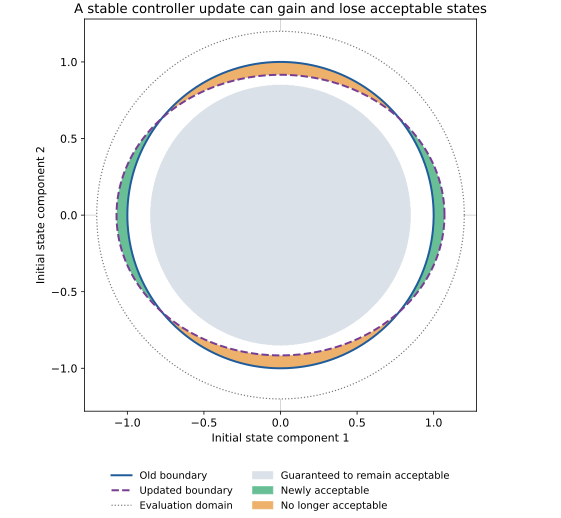

# Understanding certificate learning and its bridge to retraining

This note explains the [v3 brief](../brief.md), assuming basic linear algebra
and feedback control. The [LaTeX draft](../latex/proposal.tex) now summarizes
this scope in two pages plus references. The [v3 revision notes](v3-revisin-notes.md) record the current scope:

- **Course foundation:** specialize trajectory-based certificate learning to a
  frozen linear closed loop and quadratic candidates, with a generalization proof.
- **Main theoretical investigation:** analyze one restricted controller update,
  preserve verified decrease margins, and explain possible cost regression.
- **Ambitious extension:** establish cost-region expansion under a specified
  mechanism, or justify a local nonlinear extension.

Sections 1–4 explain the theoretical core. Sections 5–11 retain the finite-cost
examples from v2 as supporting analysis. CartPole and reading guidance follow.
Experiments support the theory; a broad PPO comparison is no longer the main
required deliverable. An expansion theorem remains optional, but the restricted
preservation result is part of the main analysis.

The textbook background is João P. Hespanha, *Linear Systems Theory*, second edition (2018), available as a [local PDF](../literature/Linear-Systems-2e.pdf). Reading pointers appear at the end. The calculations and examples below are explanations for this project, not claims of new textbook theorems or completed experiments.

## 1. Understand the three loops and their different variables

The **control loop** acts within an episode: observe the state, apply an action, and observe the next state. The **evaluation loop** selects conditions and collects trajectories of a frozen controller to estimate where it meets a requirement. The **improvement loop** uses that evidence to choose training conditions, learns an updated controller, and freezes it for a new evaluation.

| Symbol | Meaning |
| --- | --- |
| $t$, $H$ | Time within a trajectory and its finite horizon |
| $k$ | Outer evaluation–training round |
| $\theta$ | Plant parameters, such as pole length or entries of a dynamics matrix |
| $K$, $K'$ | Old and updated linear feedback gains |
| $\pi_k$ | Policy frozen for evaluation in outer round $k$ |
| $z=(\theta,s)$ | Evaluation condition: plant parameters and an initial-state distribution indexed by $s$ |
| $x_0\sim\nu_s$ | Initial state drawn according to the selected condition |
| $q_k$ | Training-condition distribution, which may change after evaluation |
| $\mu$ | Fixed reference measure used to assess coverage |

A deterministic initial state is a special case: $\nu_s$ puts all its mass at one vector $x$. In CartPole, $s$ could instead fix the pole angle while specifying randomness in other reset coordinates. Remaining episode randomness must also be declared. A coordinate should not simultaneously be treated as fixed and independently randomized.

The key separation is that **$q_k$ changes while $\mu$ stays fixed**. Training may emphasize difficult conditions, but improvement is judged on the same reference domain. Otherwise, a change in the distribution being scored could look like a change in controller performance.

## 2. Start with a family of plants and close the control loop

The revised linear example is

$$
x_{t+1}=A(\theta)x_t+B(\theta)u_t,\qquad u_t=-Kx_t.
$$

The state $x_t\in\mathbb R^n$ contains the variables needed to predict the next step; $u_t\in\mathbb R^m$ is the action. The matrices $A(\theta)$ and $B(\theta)$ describe one member of a known, low-dimensional family. For example, a scalar family could have $A(\theta)=\theta$ and $B(\theta)=1$.

Draw or choose $\theta$ once for an episode and keep it fixed throughout that trajectory. A **shared controller $K$** is used across plant parameters. Learning a different gain for every plant would be a different problem.

Substituting the feedback law gives

$$
x_{t+1}=\underbrace{[A(\theta)-B(\theta)K]}_{G_K(\theta)}x_t,
\qquad x_t=G_K(\theta)^t x_0.
$$

Thus $G_K(\theta)$ combines the plant and controller into one closed-loop matrix. Starting at $x_0=x$, the first states are $x,G_K(\theta)x,G_K(\theta)^2x$. We use $G^0=I$. A prime in $K'$ means an updated gain; transpose is written $\top$.

For these calculations, assume full-state feedback and deterministic dynamics without disturbances, saturation, action quantization, or early termination. The model is known for the analytical example: learning the controller does not mean identifying unknown dynamics. The restriction $\|x\|_2\le r$ introduced below concerns initial states, not all subsequent states.

Unlike the old fixed-plant example, this formulation can evaluate different plant parameters. However, each trajectory calculation still holds a particular $\theta$ fixed. A theorem comparing neighboring plant parameters would require a separate bound on how their matrices differ.

## 3. Learn a certificate before claiming it is valid everywhere

The preferred foundation now follows the learning viewpoint in
[Boffi et al.](../literature/boffi21a-learning-stability-certificates.pdf), with
an explicit discrete-time adaptation. The policy and the certificate are two
different learned objects:

- $K$ chooses actions and therefore changes trajectories.
- $P$ describes a candidate certificate $V_P(x)=x^\top Px$. Fitting $P$ while
  $K$ is frozen changes our description of the system, not its behavior.

A Lyapunov candidate is like a generalized energy. Positive definiteness makes
it positive away from zero. A decrease inequality makes the energy fall along
the actual dynamics. Neither the name “energy” nor a good fit is sufficient;
the inequality is the part that proves the property.

For a fixed linear closed loop, the desired inequality is

$$
V_P(G_K(\theta)x)-V_P(x)\le-\eta\|x\|^2.
$$

Because $x$ is arbitrary, this is equivalent to

$$
G_K(\theta)^\top PG_K(\theta)-P\preceq-\eta I.
$$

A state trajectory supplies pairs $(x_t,x_{t+1})$. One can fit $P$ by asking for
small violations of the decrease inequality on these pairs, while requiring
$aI\preceq P\preceq bI$ with fixed $0<a<b$. The lower bound makes $P$ positive
definite; the upper bound prevents improving the numerical margin merely by
multiplying the whole certificate by an arbitrarily large number.

The learning question is whether the fitted candidate behaves similarly on new
trajectories. Freeze $K$, sample independent plants/initial states from fixed
$D_0$, and regard a whole trajectory as one sample. A trajectory loss records the
worst violation across its steps. The [design notes](proposal-design-notes.md)
normalize decrease by $\|x_t\|^2$ for nonzero states and clip a margin loss to
$[0,1]$. At zero, the linear system stays at zero and the decrease condition
holds automatically. This avoids imposing a fixed nonzero absolute decrease
at the equilibrium.

The proof has three ingredients from Chapter 5:

1. Symmetric $P$ has $n(n+1)/2$ parameters in a bounded set.
2. Nearby matrices have similar bounded trajectory losses; the notes derive
   the Lipschitz constant explicitly.
3. Cover the matrix class by finitely many representatives, apply Hoeffding and
   a union bound, and account for the approximation error.

The resulting bound is uniform over the candidate class, so it can be applied
to the $P$ selected using those data. A confidence interval for a fixed candidate
would not automatically allow that data-dependent selection. The elementary
rate is roughly $\sqrt{d\log N/N}$ with constants and margin terms stated in
the notes; it does not reproduce the sharper source-paper rate.

**A small probability of a sampled trajectory violating the certificate is
still not a proof that every state converges to zero.** This is why the first
analytical experiment also uses known matrices as an exact verification oracle.
For each plant, calculate

$$
\eta_\theta=\lambda_{\min}(P-G_K(\theta)^\top PG_K(\theta)).
$$

A positive value proves decrease at every state for that plant. In exact
arithmetic it yields

$$
\|x_t\|^2\le(b/a)(1-\eta_\theta/b)^t\|x_0\|^2,
$$

and every ellipsoid $\{x:x^\top Px\le c\}$ is invariant. These conclusions
follow from the verified matrix inequality, not from the statistical bound.
Floating-point checks require numerical tolerances and are reported as such.

This also explains two distinct uses of data: fitting a candidate is learning;
checking whether it meets the intended conditions is verification. If fitting
succeeds but verification fails, that is evidence about the method's limits.
It does not prove the controller is unstable, and must not be hidden.

For a family, using one $P$ for every retained plant is a simplifying restriction.
Several individually stable matrices may have no common quadratic certificate.
The first family should admit one, with this assumption stated openly.

## 4. Use the decrease margin to constrain one controller update

Suppose the old $P$ is verified and $K'=K+\Delta K$. Then

$$
G'=G+E,\qquad E=-B(\theta)\Delta K.
$$

Hold $P$ fixed during this comparison. Expanding gives

$$
G'^\top PG'-P=(G^\top PG-P)+G^\top PE+E^\top PG+E^\top PE.
$$

The first term supplies the old decrease. The other terms describe how much
of it the update could consume. With $d_\theta=\|B(\theta)\Delta K\|_2$, their
combined quadratic form is bounded above by

$$
\left(2\|G^\top P\|_2d_\theta+\|P\|_2d_\theta^2\right)\|x\|^2.
$$

Thus an explicit sufficient condition is

$$
2\|G^\top P\|_2d_\theta+\|P\|_2d_\theta^2<\eta_\theta.
$$

The inequality says that the worst permitted increase is smaller than the old
verified decrease. It uses the update size and known matrices; it does not
require a new general theorem about PPO. Enforce it on every predeclared
retention plant and retain a positive fraction of each old margin.

The update can be made concrete: use old cost evaluations to select $q$, hold
$q$ fixed, compute an exact gradient of a finite weighted cost objective, and
backtrack the step until both the margin condition and a training-descent test
pass. A zero gradient or a capped unsuccessful search gives a recorded no-op.
Strict old margins and a nonzero descent direction ensure a sufficiently small
step works in the ideal uncapped search, but do not ensure a useful progress
rate. The design notes give the Armijo condition and assumptions.

The background mixture keeps broad training exposure; the margin check is what
supplies the guarantee. A small neural-network parameter change does not imply
this matrix bound for a different policy class.

**The preserved property is stability under the old certificate.** Its invariant
ellipsoids remain invariant on retained plants. Their size does not automatically
increase, and the cost threshold used for evaluation need not remain satisfied.
In an unconstrained stable linear system the true region of attraction is already
all of state space, so expanding a bounded certificate ellipsoid is not evidence
of enlarging that true region. A meaningful additional target is finite-cost
coverage or a region satisfying separately specified constraints.

A useful counterexample makes the distinction tangible. Take scalar plants
$\theta\in\{0,1\}$ with $x^+=\theta x+u$, $u=-Kx$, $x_0=1$, and cost
$J_{2,K}=1+(\theta-K)^2$. With threshold $1.25$ and $K=0.5$, both plants pass.
Training only on the upper boundary plant gives gradient $-1$; a step $0.2$
produces $K'=0.7$. Its cost improves from $1.25$ to $1.09$, while the other
plant's cost becomes $1.49$. Equal-weight coverage falls from $1$ to $1/2$.
Yet $P=1$ remains valid: the smallest decrease margin changes from $0.75$ to
$0.51$, and the perturbation bound consumes only $0.24$. Even retaining half
the old margin accepts the step.

This disproves an unconditional implication from training descent and stability
to cost-coverage improvement. It does not refute every boundary rule: sampling
both boundary plants equally gives zero gradient here. Which boundary conditions
are emphasized is part of the mechanism that must be analyzed.

The remaining sections retain the finite-cost calculations and examples. They
explain regression and possible expansion, alongside the certificate theorem;
they are not substitutes for the learning/verification distinction above.

## 5. Turn a trajectory into a quadratic cost

For fixed symmetric weights $Q\succeq0$ and $R\succeq0$, define

$$
J_{H,K}(\theta,x)
=\sum_{t=0}^{H-1}(x_t^\top Qx_t+u_t^\top Ru_t).
$$

Lower cost is better. Positive semidefiniteness means that every stage penalty is nonnegative. For example, $Q=\operatorname{diag}(10,1)$ weights error in the first state coordinate ten times as much as in the second. $R$ weights control effort. Fix coordinate units and weights before interpreting cost or distances.

The state-only objective from the previous note is the special case $R=0$. Keeping $R$ explicit makes the connection to quadratic controller learning clear without deciding its numerical value for the project. There is no separate terminal penalty. At $H=1$, the controller affects the input penalty, but cannot affect the only scored state; with $R=0$, that cost is independent of $K$.

Under feedback, $u_t^\top Ru_t=x_t^\top K^\top RKx_t$. Define the stage-cost matrix

$$
W_K=Q+K^\top RK.
$$

Then

$$
\begin{aligned}
J_{H,K}(\theta,x)
&=\sum_{t=0}^{H-1}(G_K(\theta)^t x)^\top W_K(G_K(\theta)^t x)\\
&=x^\top P_H(K,\theta)x,\\
P_H(K,\theta)
&=\sum_{t=0}^{H-1}(G_K(\theta)^t)^\top W_KG_K(\theta)^t.
\end{aligned}
$$

**$W_K$ scores one step; $P_H(K,\theta)$ summarizes the whole trajectory through its initial state.** Every summand is positive semidefinite, so $P_H$ is too. An equivalent computation, for a fixed $K,\theta$, is

$$
P_0=0,\qquad P_{H+1}=W_K+G_K(\theta)^\top P_HG_K(\theta).
$$

For a scalar closed loop with $G_K(\theta)=0.5$, $Q=1$, $R=0$, and $H=3$,

$$
J_{3,K}(\theta,x)=x^2+(0.5x)^2+(0.25x)^2=1.3125x^2.
$$

Computing this cost evaluates a given controller. Choosing a good $K$ is an additional optimization problem. With nonzero $R$, an update changes **both** the dynamics matrix $G_K$ and stage-cost matrix $W_K$; an update-size bound must account for both.

## 6. Learn a controller, then evaluate its acceptable region

For a fixed training distribution $q$ on conditions $z=(\theta,s)$, one possible linear training objective is

$$
F_q(K)=\mathbb E_{(\theta,s)\sim q}\,
       \mathbb E_{x\sim\nu_s}[J_{H,K}(\theta,x)].
$$

A small analytical experiment can optimize a finite weighted sum using gradients through the matrix formula. Stage 1 holds the controller fixed while learning its certificate. Stage 2 uses evaluation to choose $q$, then holds that distribution fixed during one gain update. This defines a manageable controller-learning example, not a claim of global convergence or a requirement to reproduce an infinite-horizon algorithm.

Training minimizes an average cost, but the evaluation question can be whether individual conditions meet a threshold. On a plant domain $\Theta$ and initial-state domain $D=\{x:\|x\|_2\le r\}$, define

$$
S_K^J=\{(\theta,x)\in\Theta\times D:J_{H,K}(\theta,x)\le h\},\qquad h>0.
$$

The superscript $J$ distinguishes this deterministic cost set from the proposal's failure-probability set $S_k$. The cost set here uses realized initial states; when a condition specifies a nontrivial initial-state distribution, expected-cost and failure-probability criteria would be different choices.

For a **fixed plant parameter**, $x^\top P_H(K,\theta)x\le h$ describes an ellipsoid if $P_H$ is positive definite, intersected with $D$. If $P=\operatorname{diag}(p_1,p_2)$ with positive entries, the ellipse has semiaxis lengths $\sqrt{h/p_1}$ and $\sqrt{h/p_2}$. Larger cost in a direction allows less initial error. For a general positive-definite matrix, eigenvectors determine the axes. A semidefinite matrix can leave unpenalized directions; intersecting with $D$ still bounds the domain.

The full region over $(\theta,x)$ is a collection of these plant-specific slices, not necessarily a single ellipsoid. For the scalar example above with $h=1$, the acceptable interval at that plant is $|x|\le\sqrt{1/1.3125}\approx0.873$, intersected with $D$.

Membership is a finite-horizon performance statement. It does not by itself prove invariance, absence of other constraint violations, or asymptotic stability.

## 7. A useful warm-up: vary the initial state

Hold $K$ and $\theta$ fixed and abbreviate $P_H(K,\theta)$ to $P$. The Euclidean matrix norm obeys

$$
|a^\top Mb|\le\|a\|_2\|M\|_2\|b\|_2.
$$

Here $\|M\|_2$ is the largest singular value, describing the maximum stretch of a vector. For symmetric positive-semidefinite $P$, it is the largest eigenvalue.

Add and subtract $x'^\top Px$ to obtain

$$
\begin{aligned}
x^\top Px-x'^\top Px'
&=(x-x')^\top Px+x'^\top P(x-x'),\\
|J_{H,K}(\theta,x)-J_{H,K}(\theta,x')|
&\le\|P\|_2(\|x\|_2+\|x'\|_2)\|x-x'\|_2\\
&\le 2r\|P_H(K,\theta)\|_2\|x-x'\|_2.
\end{aligned}
$$

The last line assumes $x,x'\in D$. This Lipschitz bound says that cost changes by at most a constant times initial-state distance. If the old cost is $h-m$ and $L=2r\|P_H(K,\theta)\|_2$, then $L\|x'-x\|_2\le m$ guarantees acceptability at $x'$. For instance, margin $m=2$ and $L=4$ protect a radius of $0.5$ within $D$.

This is sufficient, not necessary. With known matrices, directly evaluating the new start is exact; the bound explains how performance margins can justify generalization. It holds at one plant parameter and does not establish continuity in $\theta$. The cost-update bound below complements the certificate-margin result in Section 4.

Horizon and transient amplification affect both bounds because

$$
\|P_H(K,\theta)\|_2
\le\|W_K\|_2\sum_{t=0}^{H-1}\|G_K(\theta)^t\|_2^2.
$$

Even a stable matrix can temporarily amplify states. For example,

$$
G=\begin{pmatrix}0.5&4\\0&0.5\end{pmatrix},\qquad
x_0=\begin{pmatrix}0\\1\end{pmatrix}
\quad\Longrightarrow\quad
x_1=\begin{pmatrix}4\\0.5\end{pmatrix}.
$$

Both eigenvalues are $0.5$, yet the state norm grows from $1$ to about $4.03$. With $W_K=I$ and $H=2$, the cost is $17.25$. If one establishes $\|G_K(\theta)^t\|_2\le c\rho^t$ with $c\ge1$ and $0<\rho<1$, then

$$
\|P_H(K,\theta)\|_2
\le\|W_K\|_2c^2\frac{1-\rho^{2H}}{1-\rho^2}.
$$

The prefactor allows transient growth. These constants need not be uniform across plants. The finite-horizon results themselves require no stability assumption; unstable dynamics may simply make the bounds very large.

## 8. A baseline cost result: change the shared controller

Compare $K$ with $K'$ at the **same** plant parameter and initial state. Hold $A(\theta),B(\theta),Q,R,H,h,r$ fixed and set

$$
\Delta P(\theta)=P_H(K',\theta)-P_H(K,\theta).
$$

The quadratic representation immediately gives

$$
\begin{aligned}
|J_{H,K'}(\theta,x)-J_{H,K}(\theta,x)|
&=|x^\top\Delta P(\theta)x|\\
&\le\|x\|_2^2\|\Delta P(\theta)\|_2\\
&\le r^2\|\Delta P(\theta)\|_2=:b(\theta).
\end{aligned}
$$

**At each plant parameter, every start in $D$ experiences a cost change of at most $b(\theta)$.** This includes changes in the input penalty when $R\ne0$, because they are already part of $P_H$. The bound controls improvements and degradations; it does not predict their direction.

An old acceptable condition with enough margin is preserved:

$$
J_{H,K}(\theta,x)\le h-b(\theta)
\quad\Longrightarrow\quad
J_{H,K'}(\theta,x)\le h.
$$

Consequently,

$$
\{(\theta,x)\in\Theta\times D:J_{H,K}(\theta,x)\le h-b(\theta)\}
\subseteq S_{K'}^J,
$$

and losses can occur only in the band

$$
S_K^J\setminus S_{K'}^J
\subseteq B_{\rm loss}
:=\{(\theta,x)\in\Theta\times D:
 h-b(\theta)<J_{H,K}(\theta,x)\le h\}.
$$

For $h=10$ and $b(\theta)=2$, all starts at that plant with old cost at most $8$ remain acceptable. Starts between $8$ and $10$ require further checking. The band width is in cost units; it need not correspond to a geometrically thin set or small probability mass.

A single bound across plants is $\bar b=\sup_{\theta\in\Theta}b(\theta)$, **provided it is finite**. A finite grid permits taking a maximum. A continuous domain needs justified uniform bounds, for example bounded continuous matrices on a compact parameter domain with fixed finite gains and horizon. Pointwise finite-horizon calculations alone do not bound an arbitrary unbounded family.

If $b(\theta)>h$, the guaranteed set at that plant is empty; if $b(\theta)=h$, only zero-cost starts qualify. Even a correct bound can be uninformative. It can be computed after a proposed update, but does not by itself choose a useful update or prove that boundary-guided training works.

## 9. Keep the ellipse example as a fixed-plant illustration

The existing figure remains useful as one slice of the family, with $R=0$. Set

$$
A=B=I_2,\quad Q=I_2,\quad H=2,\quad h=1.25,\quad r=1.2,
\qquad
K_\kappa=\operatorname{diag}(0.5+\kappa,0.5-\kappa).
$$

Here $\kappa$ is a **controller parameter**, not the plant parameter $\theta$. Compare $\kappa=0$ with $\kappa'=0.2$. The two closed-loop matrices are

$$
G_K=\operatorname{diag}(0.5,0.5),\qquad
G_{K'}=\operatorname{diag}(0.3,0.7),
$$

so both controllers are stable. Their cost matrices are

$$
P_2(K)=\operatorname{diag}(1.25,1.25),\qquad
P_2(K')=\operatorname{diag}(1.09,1.49).
$$

The old acceptable region is the unit disk; the new ellipse extends farther along one axis and less far along the other.

| Initial state | Old cost | New cost | Outcome |
| --- | ---: | ---: | --- |
| $(1,0)^\top$ | 1.25 | 1.09 | More acceptable margin |
| $(0,1)^\top$ | 1.25 | 1.49 | Becomes unacceptable |
| $(1.04,0)^\top$ | 1.352 | 1.178944 | Becomes acceptable |

Here $\Delta P=\operatorname{diag}(-0.16,0.24)$ and $b=1.2^2(0.24)=0.3456$. Thus $J_{2,K}\le0.9044$ is protected, giving the disk of radius $\sqrt{0.9044/1.25}\approx0.8506$.

The blue boundary is old; the dashed purple boundary is updated. Green regions are gains, orange regions are losses, and the gray disk is protected by the bound. White areas between the disk and actual losses show conservatism. The dotted outer circle is $D$.

Both ellipses fit inside $D$. Their geometric areas are approximately $3.1416$ and $3.0814$, so the update loses net area despite improving some boundary conditions. Under a different reference measure placing equal mass on just $(1,0)^\top$ and $(0,1)^\top$, coverage instead falls from $1$ to $1/2$. Always specify the reference measure.

This illustrates interference from shared controller parameters; it is not a PPO experiment or a parameter-randomization experiment. The existing [figure source](figures/linear-control-retraining.py) reproduces the displayed costs and plot.

## 10. A small example connects plant variation to training

Now vary the plant itself:

$$
x_{t+1}=\theta x_t+u_t,\qquad u_t=-Kx_t,
\qquad \theta\in[0,2],\quad x_0=1.
$$

Take $H=2$, $Q=1$, $R=0$, and $h=1.25$. Then

$$
J_{2,K}(\theta,1)=1+(\theta-K)^2,
\qquad
S_K^J=\{\theta\in[0,2]:|\theta-K|\le0.5\}.
$$

For this example the initial state is fixed, so the cost region is a set of plant parameters. Updating $K=0.5$ to $K'=0.7$ moves it from $[0,1]$ to $[0.2,1.2]$. Under the uniform reference probability measure on $[0,2]$, gains and losses each have mass $0.1$, and coverage remains $0.5$. Improving performance on some plants does not necessarily improve total acceptable coverage.

There is also an explicit training interpretation. With a training distribution $q$ over $\theta$,

$$
F_q(K)=1+\mathbb E_q[(\theta-K)^2],\qquad
\frac{dF_q}{dK}=2(K-\mathbb E_q[\theta]).
$$

A gradient step of size $\eta>0$ gives

$$
K'=K-2\eta(K-\mathbb E_q[\theta]).
$$

Suppose $q$ puts equal mass at $\theta=0.9$ and $1.1$, near the old upper cost boundary. From $K=0.5$, a step with $\eta=0.2$ gives $K'=0.7$. The training objective drops from $1.26$ to $1.10$, even though reference coverage does not increase. This connects a targeted distribution, an actual optimization step, and gains and losses across plants.

The choices above are illustrative, not a newly selected experiment protocol. This deterministic cost boundary is also different from a Bernoulli reliability boundary. The example makes the research question concrete: which targeting rules and update restrictions produce useful improvements under the fixed reference measure?

## 11. Cost drift and the optional expansion question

The direct bound compares given controllers. A stronger analysis should connect performance change to the update mechanism and explain gains as well as losses.

### Bound drift using update size

At one plant parameter, abbreviate $G=G_K(\theta)$, $G'=G_{K'}(\theta)$, and $\Delta K=K'-K$. Assume $\|G\|_2,\|G'\|_2\le M$ with $M\ge1$. A telescoping identity gives, for $t\ge1$,

$$
G'^t-G^t=\sum_{i=0}^{t-1}G'^{\,t-1-i}(G'-G)G^i,
\qquad
\|G'^t-G^t\|_2\le tM^{t-1}\|B(\theta)\|_2\|\Delta K\|_2.
$$

When $R\ne0$, also account for $\Delta W=W_{K'}-W_K$:

$$
\Delta W=K'^\top R\Delta K+\Delta K^\top RK,
\qquad
\|\Delta W\|_2\le\|R\|_2(\|K'\|_2+\|K\|_2)\|\Delta K\|_2.
$$

For $U=G'^t$ and $V=G^t$, split the cost-summand difference into

$$
U^\top W_{K'}U-V^\top W_KV
=(U-V)^\top W_KU+V^\top W_K(U-V)+U^\top\Delta WU.
$$

Applying the norm bound and summing yields

$$
\begin{aligned}
b(\theta)\le r^2\Bigg[
&2\|W_K\|_2\|B(\theta)\|_2\|\Delta K\|_2
  \sum_{t=1}^{H-1}tM^{2t-1}\\
&+\|\Delta W\|_2\sum_{t=0}^{H-1}M^{2t}\Bigg].
\end{aligned}
$$

For $R=0$, $\Delta W=0$ and $W_K=Q$, recovering the earlier state-only formula. A uniform family bound requires uniform matrix bounds. The expression exposes dependence on update size, horizon, and amplification, but can be loose. Limiting update size restricts possible damage without guaranteeing a favorable direction.

### Show enough gains to outweigh losses

Suppose a specified update reduces cost by at least $a>0$ on a set $T\subseteq\Theta\times D$. Then every condition in

$$
E=T\cap\{(\theta,x):h<J_{H,K}(\theta,x)\le h+a\}
$$

becomes acceptable. With the loss band from Section 8 and a fixed reference probability measure $\mu$ on this domain,

$$
\mu(S_{K'}^J)-\mu(S_K^J)
\ge\mu(E)-\mu(B_{\rm loss}).
$$

Thus $\mu(E)>\mu(B_{\rm loss})$ suffices for **net coverage expansion**. It does not imply set inclusion: some old acceptable conditions can still be lost. The research challenge is to connect useful values of $a$, $b(\theta)$, and $T$ to an actual training distribution and update rule. Merely assuming those properties does not explain why boundary-guided training succeeds.

A stronger condition, $P_H(K',\theta)\preceq P_H(K,\theta)$ for every plant, guarantees that cost never increases, hence $S_K^J\subseteq S_{K'}^J$. It does not alone ensure strict expansion. Neither the ellipse example nor arbitrary boundary sampling satisfies this condition automatically.

These calculations explain why counterexamples and update analysis belong to the **main research**. The certificate-preservation condition in Section 4 is required main analysis. Expansion under an actual selection/update mechanism remains the **ambitious extension**.

## 12. Use CartPole as a supporting illustration

The CartPole study uses

$$
p_k(z)=\Pr(\text{recovery fails under frozen }\pi_k\mid z),
\qquad S_k=\{z:p_k(z)\le\alpha\}.
$$

A condition includes plant parameters and an initial-state distribution. Recovery requires survival for $500$ steps with final-100-step RMS angle at most $5^\circ$, using the relaxed $90^\circ$ angle termination cutoff and retaining other termination rules. This differs from the linear example in several ways:

| Linear analytical model | Supporting CartPole illustration |
| --- | --- |
| Known family $A(\theta),B(\theta)$ and continuous linear feedback | Nonlinear dynamics and discrete-action learned policies |
| Exact cost at each $(\theta,x)$ | Conditional failure probability at $z=(\theta,s)$ |
| Quadratic cost threshold $h$ | Recovery-failure tolerance $\alpha$ |
| Matrix calculations give exact regions | Fresh rollouts give estimates and certificates |
| Shared gain learned under a specified distribution | PPO branches trained under matched condition-selection rules |

In outer round $k$, the evaluator uses time-uniform bounds for each grid condition. An upper bound at most $\alpha$ certifies that condition acceptable. Fresh episode outcomes and statistical error allocation across conditions, methods, and rounds support a campaign-wide error budget $\delta$. The guarantee concerns the declared grid and conditional episode law; GP predictions between points do not become direct certificates.

The evaluator is assessed by **certified acceptable coverage at a fixed rollout budget**. Controller improvement is assessed under the fixed reference measure, with gains, regressions, and uncertainty reported. A larger certified set can reflect more evaluation data rather than a better policy, so differences between certificates alone do not identify true gains and losses.

If the optional PPO illustration is run, compare uniform and reliability-boundary targets first; intermediate difficulty is an optional third comparator. The mixture is

$$
q_k=(1-\lambda)q_{\rm base}+\lambda q_{{\rm target},k}
$$

with uniform targets, targets near $\widehat p_k=\alpha$, and intermediate-difficulty targets scored by $\widehat p_k(1-\widehat p_k)$. The latter peaks at $1/2$, which need not be the acceptance threshold. An evaluation acquisition rule and a training-condition score serve different purposes: useful evidence for certification need not be useful training data.

PPO branches share the starting checkpoint, background mixture, objective, optimizer, and budgets. Collect fresh on-policy training trajectories, then freeze the updated policy and evaluate with fresh data. Evaluation trajectories of the old controller are not outcomes of the updated controller. A surrogate may carry information forward to propose conditions, but old outcomes cannot directly certify the new policy.

### Why a cost bound does not automatically bound failure probability

For a score-defined failure event $\{C>h\}$, suppose a specified common-randomness coupling gives the pathwise bound $|C'-C|\le\varepsilon$. Then

$$
|\Pr(C'>h)-\Pr(C>h)|\le\Pr(|C-h|\le\varepsilon).
$$

An outcome can change classification only near the old threshold. To make the probability change small, one needs control of the mass near that threshold. The deterministic linear proof does not establish these assumptions for CartPole recovery, which also includes termination. Likewise, a small neural-network parameter update does not automatically bound closed-loop trajectory change.

The extension to $A(\theta),B(\theta)$ addresses plant variation **within the linear family**. It does not justify a linear approximation across large CartPole angles or quantized actions. The first expansion target is the continuous-cost set; a failure-probability theorem is deferred. A nonlinear extension would need a remainder bound and an invariant neighborhood. At zero state the implemented two-force action rule still applies a nonzero force, so even the equilibrium assumption must be reconsidered.

### Why finite-horizon acceptability differs from stability

At a fixed plant, if $G_K(\theta)$ is Schur stable, the infinite sum

$$
P_\infty=\sum_{t=0}^{\infty}(G_K(\theta)^t)^\top W_KG_K(\theta)^t
$$

satisfies $G_K(\theta)^\top P_\infty G_K(\theta)-P_\infty=-W_K$. With $W_K\succ0$, this gives a positive-definite quadratic function decreasing along nonzero trajectories. In contrast, the finite sum obeys

$$
G_K(\theta)^\top P_HG_K(\theta)-P_H
=(G_K(\theta)^H)^\top W_KG_K(\theta)^H-W_K,
$$

which need not be negative semidefinite. Finite-horizon cost sublevel sets therefore do not automatically certify stability or invariance. The certificate in Sections 3–4 can be verified directly without equating it to a cost matrix or reproducing an infinite-horizon optimization theorem.

## 13. Reading path, deliverables, and remaining choices

The textbook supplies the following background. Page references use printed pages; add 19 for this local PDF's viewer page number.

| Read | Printed pages / PDF pages | What it supplies |
| --- | --- | --- |
| §1.1.2 and §6.5 | 6 / 25; 69 / 88 | Discrete-time models and matrix-power trajectories |
| §8.2 and §8.4 | 88–91 / 107–110 | Norm inequalities and quadratic forms |
| §8.6 | 95–97 / 114–116 | Stability and the discrete-time Lyapunov equation |
| §10.1 and §10.4, as context | 120 / 139; 122–123 / 141–142 | Quadratic performance and feedback design |
| §7.2, optionally | 78–79 / 97–98 | Transient amplification in matrix powers |

The revised proposal's closest controller-learning references are:

- [Fujinami et al., *Policy Gradient for LQR with Domain Randomization* (2025)](https://arxiv.org/abs/2503.24371): analyzes policy-gradient optimization of domain-randomized LQR average cost under system-heterogeneity assumptions. It motivates learning one controller across a family. Its convergence guarantee is not automatically a guarantee for our finite-horizon objective, changing training distributions, or acceptable-region expansion.
- [Fujinami et al., *Policy Gradient over History-Dependent Policy Classes for LQR with Domain Randomization* (2026)](https://arxiv.org/abs/2609.16300): extends the analysis to controllers with memory and a curriculum that expands controller memory. This concerns controller expressiveness; our proposed adaptation changes the training-condition distribution. Implementing history-dependent controllers is not required.

For evaluation and improvement, the [proposal bibliography](../latex/references.bib) includes Gotovos and Letham on level-set estimation and Howard on confidence sequences. The local [Florensa paper](../literature/florensa17a.pdf) explains performance-guided start-state curricula, the [Rutherford paper](../literature/2408.15099v3.pdf) motivates the mixed-success score, and the [Berkenkamp paper](../literature/1705.08551v3.pdf) illustrates the additional structure needed for Lyapunov-based safe-region arguments. These are complementary connections, not interchangeable guarantees.

The preferred foundation paper is now [Boffi et al., Learning Stability
Certificates from Data](../literature/boffi21a-learning-stability-certificates.pdf).
Read Sections 3–4 for the statistical formulation and compare its continuous-time
assumptions with our discrete-time adaptation. Its quadratic class is already
analyzed; using quadratics is a pedagogical restriction, not a novelty claim.
[Zhang et al.](../literature/zhang22a-adversarially-robust-stability-certificates.pdf)
is optional robustness context, not a second required reproduction.

| Course resource | Use in this project |
| --- | --- |
| [Chapter 2](../../resources/ch2%20Two%20Motivating%20Problems.pdf), §§2.2–2.4 | Policy changes, feedback, and trajectory differences |
| [Chapter 3](../../resources/ch3%20Dynamics,%20Stability,%20and%20Basic%20Lyapunov%20Theory-1.pdf), Theorem 3.10 and Example 3.12 | Discrete-time decrease and quadratic verification |
| [Chapter 5](../../resources/ch5%20Empirical%20Risk%20Minimization%20for%20Nonlinear%20Predictors.pdf), uniform convergence and §5.6 | Generalization, one trajectory per independent sample |

Chapter 5's predictor loss is evaluated on trajectories of a fixed underlying
system. Controller updates change the trajectories themselves. Our Stage 1 holds
$K$ fixed while fitting $P$; Stage 2 handles the changed controller with an
explicit perturbation argument. Chapter 4's system identification is not silently
claimed by learning a gain with known matrices.

Minimum deliverables are an accessible certificate-generalization proof,
verified-margin update analysis, a cost-regression bound, counterexamples, and
small numerical checks. The [design notes](proposal-design-notes.md) spell out
the proof assumptions and the gradient/backtracking mechanism. The scalar and
ellipse numbers above remain illustrations, not selected experimental outcomes.

The finite family, gain, certificate bounds, sample law, horizon, loss margin,
retention plants, cost threshold, step rule, and budgets must be fixed before
experiments. One outer update is sufficient for the minimum study. If CartPole
is used, its failure tolerance and statistical budget remain symbolic until
protocol design. Professor feedback should focus on the choice of foundation
paper and whether this restricted theoretical contribution has suitable depth.
